#  stm32-hal-devices

适配 STM32 HAL 库的常用外设/传感器模块，提供统一的配置入口与简单的使用接口。

****

**🔨 模块持续扩展，项目持续改进中...**

**⭐ 欢迎提出Issues和PR，如果这个项目对你有帮助，请给个 Star！**

## 📑 目录

- [📖 项目简介](#-项目简介)
- [📁 项目结构](#-项目结构)
- [🚀 快速开始](#-快速开始)
  - [1. 安装STM32CubeIDE](#1-安装stm32cubeide)
  - [2. 新建并配置工程](#2-新建并配置工程)
  - [3. 导入Devices库](#3-导入devices库)
- [⚙️ 模块配置](#️-模块配置)
  - [1. OLED 显示模块](#1-oled-显示模块)
  - [2. MPU6050 六轴传感器模块](#2-mpu6050-六轴传感器模块)
  - [3. TB6612 电机驱动模块](#3-tb6612-电机驱动模块)
  - [4. Encoder 编码器模块](#4-encoder-编码器模块)
  - [5. Serial 串口模块](#5-serial-串口模块)
  - [6. HCSR04 超声波测距模块](#6-hcsr04-超声波测距模块)
  - [7. Tracker 五路循迹模块](#7-tracker-五路循迹模块)
  - [8. AT24CXX 存储模块](#8-at24cxx-存储模块)
  - [9. W25QXX 存储模块](#9-w25qxx-存储模块)
  - [10. AHT20 温湿度传感器模块](#10-aht20-温湿度传感器模块)
  - [11. ST7789 显示模块](#11-st7789-显示模块)
  - [12. XPT2046 触摸模块](#12-xpt2046-触摸模块)
  - [13. ICM42688P 六轴传感器模块](#13-icm42688p-六轴传感器模块)
  - [14. SDCard 存储模块](#14-sdcard-存储模块)
  - [15. ES8388 音频编解码模块](#15-es8388-音频编解码模块)
  - [16. WIFI12F 模块](#16-wifi12f-模块)
- [📧 联系方式](#-联系方式)

## 📖 项目简介

本项目为 STM32 HAL 库提供了一套通用的外设/传感器驱动模块。所有模块通过统一的 `config.h` 配置文件进行管理，支持模块化使能和硬件映射，方便在不同 STM32 项目中快速集成和使用。

## 📁 项目结构

```
stm32-hal-devices/
├── config.h                # 统一配置文件（硬件映射与模块使能）
├── OLED/                 	# I2C OLED 显示模块
├── MPU6050/                # MPU6050 六轴传感器模块
├── TB6612/                	# TB6612 双路电机驱动模块
├── Encoder/               	# 轮式霍尔AB编码器模块  
├── Serial/                 # Serial 串口模块
├── HCSR04/                 # HC-SR04 超声波测距模块
├── Tracker/                # 五路循迹传感器模块
├── AT24CXX/                # AT24CXX 存储模块
├── W25QXX/                 # W25QXX 存储模块
├── AHT20/                  # AHT20 温湿度传感器模块
├── ST7789/                 # ST7789 显示模块
├── XPT2046/                # XPT2046 触摸模块
├── SDCard/                 # SD 卡存储模块（含 FatFs）
├── ES8388/                 # ES8388 音频编解码模块
├── WIFI12F/                # WIFI12F 无线模块
├── images/
├── README.md              
└── LICENSE
```

## 🚀 快速开始

### 1. 安装 STM32CubeIDE

- 下载并安装：[STM32CubeIDE](https://www.st.com.cn/zh/development-tools/stm32cubeide.html)。

  **注意**：选择安装**1.19.0**版本的。

  

- 配置及汉化教程：[STM32CubeIDE配置及汉化教程](https://blog.csdn.net/c858845275/article/details/144321873)。

### 2. 新建并配置工程

- 选择 `文件` ->  `新建` -> `STM32 Project`。

- 选择芯片型号 `STM32F103C8T6`（以stm32f103c8t6为例），点击下一步。

  

- 填写项目名称 `test`，其他选项保持默认，点击完成。

  

- 打开 `Pinout & Configuration` 选项卡：

  - 点击 `RCC`，将 `HSE` 设置为 `Cystal/Ceramic Resonator`。

    

  - 点击 `SYS`，将 `DEBUG` 设置为 `Serial Wire`。

    

- 打开 `Clock Configuration` 选项卡：

  - 选择 `HSE` 频率为 `8MHz`。
  - 将 `SYSCLK` 设置为 `72MHz`。
    

- 打开 `Project Manager` 选项卡，进入 `Code Generator` 选择框，勾选：

  

- 按 `Ctrl + S` 生成代码，点击上方工具栏中的🔨图标编译无报错则表示生成的工程没有问题。

  

### 3. 导入 Devices 库

- 右键点击工程 -> 点击 `显示位置` -> 点击 `系统资源管理器`。

  

- 右键打开终端，输入以下命令克隆当前工程导入Devices库：

  ```bash
  git clone https://github.com/Lee-Stone/stm32-hal-devices.git Devices
  ```

  

- 刷新工程，点击 `项目` -> 点击 `属性` -> 点击 `C/C++ 常规` -> 点击 `路径和符号` -> 在 `包含` 和 `源位置` 中添加Devices库路径。

  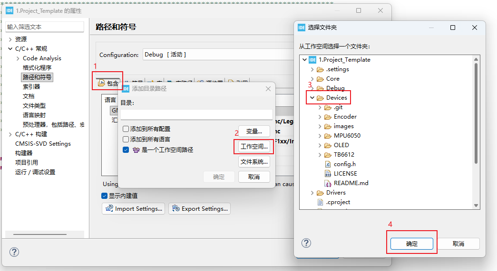

  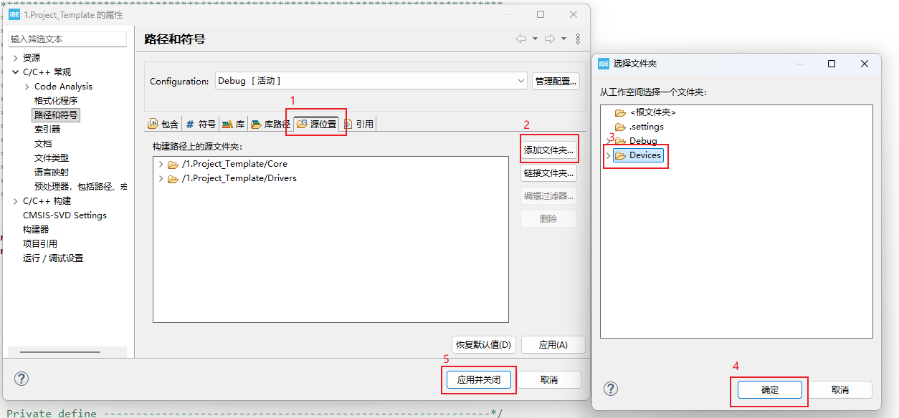

- 点击 `应用并关闭` -> 点击工具栏🔨图标编译无报错则成功导入Devices库。

## ⚙️ 模块配置

### 1. OLED 显示模块

支持4针脚 0.96 寸 I2C OLED 显示屏（SSD1306 控制器），使用软件模拟 I2C。


#### 硬件连接

| OLED引脚 | STM32引脚 | 说明 |
|---------|----------|------|
| VCC | 3.3V/5V | 电源 |
| GND | GND | 公共地 |
| SCL | GPIO输出（PB8） | I2C时钟线（软件模拟） |
| SDA | GPIO输出（PB9） | I2C数据线（软件模拟） |

#### CubeMX 配置

**添加路径：**

- 点击 `项目` -> 点击 `属性` -> 点击 `C/C++ 常规` -> 点击 `路径和符号` -> 在 `包含` 中添加 `Devices/OLED` 

  

**GPIO配置：**

- 选择两个 GPIO 引脚（例如 PB8、PB9）

- 设置为 **GPIO_Output**

  

- GPIO output level：**Push-Pull**

- GPIO mode：**High**

- Maximum output speed：**High**

- User Label：SCL引脚设置为 **OLED_SCL** 、SDA引脚设置为 **OLED_SDA**

- 其他选项保持默认配置

​	

​	

#### config.h 配置

```c
// 使能OLED模块
#define DEVICE_OLED     1
#if DEVICE_OLED 
    #include "gpio.h"
    // GPIO控制宏（CubeMX生成的引脚名称）
    #define OLED_W_SCL(x)           HAL_GPIO_WritePin(OLED_SCL_GPIO_Port, OLED_SCL_Pin, (x))
    #define OLED_W_SDA(x)           HAL_GPIO_WritePin(OLED_SDA_GPIO_Port, OLED_SDA_Pin, (x))
#endif
```

#### API 接口

```c
void OLED_Init(void);                          // 初始化OLED
void OLED_Clear(void);                         // 清屏

// 显示字符和字符串（行：1-4，列：1-16）
void OLED_ShowChar(uint8_t Line, uint8_t Column, char Char);
void OLED_ShowString(uint8_t Line, uint8_t Column, char *String);

// 显示数字
void OLED_ShowNum(uint8_t Line, uint8_t Column, uint32_t Number, uint8_t Length);
void OLED_ShowSignedNum(uint8_t Line, uint8_t Column, int32_t Number, uint8_t Length);
void OLED_ShowHexNum(uint8_t Line, uint8_t Column, uint32_t Number, uint8_t Length);
void OLED_ShowBinNum(uint8_t Line, uint8_t Column, uint32_t Number, uint8_t Length);

// 显示浮点数
void OLED_ShowSignedFloat(uint8_t line, uint8_t column, float value, uint8_t intWidth);
```

#### 使用示例

```c
#include "OLED.h"

int main(void)
{
    OLED_Init();
    OLED_Clear();

    // 第1行显示标题
    OLED_ShowString(1, 1, "STM32 HAL");

    // 第2行显示整数
    OLED_ShowString(2, 1, "Count:");
    OLED_ShowNum(2, 8, 12345, 5);

    // 第3行显示浮点数
    float speed = -12.345f;
    OLED_ShowString(3, 1, "Speed:");
    OLED_ShowSignedFloat(3, 8, speed, 3);  // 显示为 "-12.34"

    // 第4行显示十六进制
    OLED_ShowString(4, 1, "ID:0x");
    OLED_ShowHexNum(4, 6, 0x68, 2);

    while (1)
    {
        HAL_Delay(10);
    }
}
```

---

### 2. MPU6050 六轴传感器模块

支持三轴陀螺仪和三轴加速度计的 MPU6050 传感器，支持 DMP（数字运动处理器）进行姿态解算，使用硬件I2C。


#### 硬件连接

| MPU6050引脚 | STM32引脚 | 说明 |
|------------|----------|------|
| VCC | 3.3V | 电源（注意：不能接5V） |
| GND | GND | 公共地 |
| SCL | I2C2_SCL（PB10） | I2C时钟线 |
| SDA | I2C2_SDA（PB11） | I2C数据线 |

#### CubeMX 配置

**添加路径：**

- 点击 `项目` -> 点击 `属性` -> 点击 `C/C++ 常规` -> 点击 `路径和符号` -> 在 `包含` 中添加 `Devices/MPU6050`

  

**I2C配置：**

- 选择两个 I2C 引脚（例如PB10、PB11）

- 分别设置为 **I2C2_SCL** 和 **I2C2_SDA**

  

- 找到 **I2C2** 使能 **I2C** 模式

- I2C Speed Mode 设置为 **Standard Mode**（100kHz）或 **Fast Mode**（400kHz）

- 其他选项保持默认配置

​	

#### config.h 配置

```c
// 使能MPU6050模块
#define DEVICE_MPU6050  1
#if DEVICE_MPU6050
    #include "i2c.h"
    // I2C接口
    #define MPU6050_I2C             hi2c2
#endif
```

#### API 接口

```c
void MPU6050_Init(void);                       // 基础初始化（寄存器配置）
uint8_t MPU6050_GetID(void);                   // 获取设备ID（正常为0x68）

// 原始数据读取
void MPU6050_GetData(int16_t *AccX, int16_t *AccY, int16_t *AccZ,
                     int16_t *GyroX, int16_t *GyroY, int16_t *GyroZ);

// DMP姿态解算
int MPU6050_DMP_Init(void);                    // DMP初始化（返回0成功）
int MPU6050_DMP_ReadEuler(float *pitchDeg, float *rollDeg, float *yawDeg); // 读取欧拉角（度）
float MPU6050_DMP_GetROSGyroz(void);           // 获取Z轴角速度（rad/s，ROS格式）
```

#### 使用示例

```c
#include "MPU6050.h"
#include "OLED.h"  

int main(void)
{
    // 初始化OLED用于显示
    OLED_Init();
    OLED_Clear();
    
    // 初始化MPU6050
    MPU6050_Init();
    uint8_t id = MPU6050_GetID();
    
    OLED_ShowString(1, 1, "MPU ID:");
    OLED_ShowHexNum(1, 9, id, 2);  // 应显示0x68
    
    while (1)
    {
        int16_t ax, ay, az, gx, gy, gz;
        MPU6050_GetData(&ax, &ay, &az, &gx, &gy, &gz);
        
        // 显示加速度数据
        OLED_ShowString(2, 1, "Acc:");
        OLED_ShowSignedNum(2, 6, ax, 5);
        
        // 显示陀螺仪数据
        OLED_ShowString(3, 1, "Gyr:");
        OLED_ShowSignedNum(3, 6, gz, 5);
        
        HAL_Delay(100);
    }
}

// 方式2：使用DMP姿态解算
int main(void)
{
    OLED_Init();
    OLED_Clear();
    
    // 初始化MPU6050 DMP
    while (MPU6050_DMP_Init());
    OLED_ShowString(1, 1, "DMP OK");
        
    while (1)
    {
        float pitch, roll, yaw;
        if (MPU6050_DMP_ReadEuler(&pitch, &roll, &yaw) == 0)
        {
            OLED_ShowString(2, 1, "P:");
            OLED_ShowSignedFloat(2, 4, pitch, 3);

            OLED_ShowString(3, 1, "R:");
            OLED_ShowSignedFloat(3, 4, roll, 3);

            OLED_ShowString(4, 1, "Y:");
            OLED_ShowSignedFloat(4, 4, yaw, 3);
        }

        HAL_Delay(50);
    }
}
```

---

### 3. TB6612 电机驱动模块

支持双路直流电机驱动的 TB6612FNG 芯片，支持 PWM 调速和方向控制。


#### 硬件连接

| TB6612引脚 | STM32引脚 | 说明 |
|-----------|----------|------|
| PWMA | TIM2_CH1（PA0） | 电机A的PWM信号 |
| AIN1 | GPIO输出（PA4） | 电机A方向控制1 |
| AIN2 | GPIO输出（PA5） | 电机A方向控制2 |
| PWMB | TIM2_CH2（PA1） | 电机B的PWM信号 |
| BIN1 | GPIO输出（PA11） | 电机B方向控制1 |
| BIN2 | GPIO输出（PA12） | 电机B方向控制2 |
| VM | 电机电源 | 电机驱动电压 |
| VCC | 3.3V/5V | 逻辑电平 |
| GND | GND | 公共地 |

#### CubeMX 配置

**添加路径：**

- 点击 `项目` -> 点击 `属性` -> 点击 `C/C++ 常规` -> 点击 `路径和符号` -> 在 `包含` 中添加 `Devices/TB6612`

  

**定时器配置：**

- 选择两个定时器通道引脚（例如PA0、PA1）用于PWM输出

- 分别设置为 **TIM2_CH1** 和 **TIM2_CH2**

  

- 找到 **TIM2** 将Channel 1 和 Channel 2 设置为 **PWM Generation CHx**

- Prescaler (PSC)：**0**（不分频 频率为72M / 1 / 7200 = 1000Hz）

- Counter Mode：**Up**

- Counter Period (ARR)：**7200 - 1**（最大占空比为7200）

- 其他选项保持默认配置

  

**GPIO配置：**

- 选择 4 个 GPIO 引脚（例如 PA4、PA5、PA11、PA12）用于方向控制

- 设置为 **GPIO_Output**

  

- GPIO output level：**Low**

- GPIO mode：**Push Pull**

- GPIO Pull-up/Pull-down：**No pull-up and no pull-down**

- Maximum output speed：**Low**

- User Label：分别设置为 **TB6612_AIN1**、**TB6612_AIN2**、**TB6612_BIN1**、**TB6612_BIN2**

- 其他选项保持默认配置

  

#### config.h 配置

```c
// 使能TB6612模块
#define DEVICE_TB6612 1
#if DEVICE_TB6612
    #include "gpio.h"
    #include "tim.h"    
    // PWM定时器和通道
    #define TB6612_PWMA_TIM         htim2
    #define TB6612_PWMA_CH          TIM_CHANNEL_1
    #define TB6612_PWMB_TIM         htim2
    #define TB6612_PWMB_CH          TIM_CHANNEL_2
    // 电机方向修正（1为正向，-1为反向）
    #define TB6612_DIRA             1
    #define TB6612_DIRB             1
    // GPIO控制宏（CubeMX生成的引脚名称）
    #define AIN1(x)                 HAL_GPIO_WritePin(TB6612_AIN1_GPIO_Port, TB6612_AIN1_Pin, (x))
    #define AIN2(x)                 HAL_GPIO_WritePin(TB6612_AIN2_GPIO_Port, TB6612_AIN2_Pin, (x))
    #define BIN1(x)                 HAL_GPIO_WritePin(TB6612_BIN1_GPIO_Port, TB6612_BIN1_Pin, (x))
    #define BIN2(x)                 HAL_GPIO_WritePin(TB6612_BIN2_GPIO_Port, TB6612_BIN2_Pin, (x))
#endif
```

#### API 接口

```c
void TB6612_Init(void);                        	// 初始化（启动PWM）
void TB6612_Motor(int16_t motora, int16_t motorb); // 控制电机（正值正转，负值反转）
```

#### 使用示例

```c
#include "TB6612.h"
#include "OLED.h"  

int main(void)
{
    // 初始化TB6612
    TB6612_Init();
    
    // 初始化OLED显示
    OLED_Init();
    OLED_Clear();
    OLED_ShowString(1, 1, "TB6612 Test");
    
    while (1)
    {
        // 前进 - 两个电机都以500的速度正转（范围：-999~999）
        OLED_ShowString(2, 1, "Forward     ");
        TB6612_Motor(500, 500);
        HAL_Delay(2000);
        
        // 停止
        OLED_ShowString(2, 1, "Stop        ");
        TB6612_Motor(0, 0);
        HAL_Delay(1000);
        
        // 后退
        OLED_ShowString(2, 1, "Backward    ");
        TB6612_Motor(-500, -500);
        HAL_Delay(2000);
        
        // 停止
        TB6612_Motor(0, 0);
        HAL_Delay(1000);
        
        // 左转 - 左电机反转，右电机正转
        OLED_ShowString(2, 1, "Turn Left   ");
        TB6612_Motor(-300, 300);
        HAL_Delay(1000);
        
        // 右转 - 左电机正转，右电机反转
        OLED_ShowString(2, 1, "Turn Right  ");
        TB6612_Motor(300, -300);
        HAL_Delay(1000);
        
        // 停止
        TB6612_Motor(0, 0);
        HAL_Delay(1000);
    }
}
```

---

### 4. Encoder 编码器模块

支持两个轮式霍尔编码器速度读取，使用定时器的编码器模式。


#### 硬件连接

| 编码器引脚 | STM32引脚 | 说明 |
|-----------|----------|------|
| A相（左轮） | TIM3_CH1（PA6） | 编码器A相信号 |
| B相（左轮） | TIM3_CH2（PA7） | 编码器B相信号 |
| A相（右轮） | TIM1_CH1（PA8） | 编码器A相信号 |
| B相（右轮） | TIM1_CH2（PA9） | 编码器B相信号 |
| VCC | 3.3V/5V | 电源 |
| GND | GND | 公共地 |

#### CubeMX 配置

**添加路径：**

- 点击 `项目` -> 点击 `属性` -> 点击 `C/C++ 常规` -> 点击 `路径和符号` -> 在 `包含` 中添加 `Devices/Encoder`

  

**定时器配置：**

- 选择两个不同的定时器的通道1和通道2引脚（只有定时器的通道1和通道2才能设置为编码器模式，例如A6、A7、A8、A9）用于编码器模式

- 分别设置为 **TIMx-CH1** 和 **TIMx-CH2**

  

- 找到 **TIM1** 和 **TIM3** 设置 Combined Channels 为 **Encoder Mode**

- Prescaler (PSC)：**0**（不分频）

- Counter Period (ARR)：**65535**

- Encoder Mode：**Encoder Mode TI1 and TI2**（AB相四倍频）

- Polarity：**Rising Edge**

- 其他选项保持默认配置

  

#### config.h 配置

```c
// 使能编码器模块
#define DEVICE_ENCODER  1
#if DEVICE_ENCODER
    #include "tim.h"
    // 编码器定时器
    #define Encoder_Left            htim3
    #define Encoder_Right           htim1
    // 机械参数
    #define ENCODER_WHEEL_DIAMETER  0.065f      // 轮径（米）
    #define ENCODER_PULSE_PER_REV   1470.0f     // 编码器每转一圈的脉冲数
    #define ENCODER_PI              3.1415926f
#endif
```

#### API 接口

```c
void Encoder_Init(void);                       // 初始化（启动编码器）
void Encoder_Read(float *left, float *right);  // 读取左右轮速度（m/s）
```

#### 使用示例

```c
#include "Encoder.h"
#include "OLED.h" 

float left_speed, right_speed;

int main(void)
{
    // 初始化编码器
    Encoder_Init();
    
    // 初始化OLED显示
    OLED_Init();
    OLED_Clear();
    OLED_ShowString(1, 1, "Encoder Test");
    
    while (1)
    {
        Encoder_Read(&left_speed, &right_speed);
        
        // 显示左右轮速度
        OLED_ShowString(2, 1, "L:");
        OLED_ShowSignedFloat(2, 4, left_speed, 3);
        OLED_ShowString(2, 12, "m/s");
        
        OLED_ShowString(3, 1, "R:");
        OLED_ShowSignedFloat(3, 4, right_speed, 3);
        OLED_ShowString(3, 12, "m/s");
        
        HAL_Delay(10);
    }
}
```

---

### 5. Serial 串口模块

支持多路 USART 串口，基于结构体实例管理，每路串口独立互不干扰。

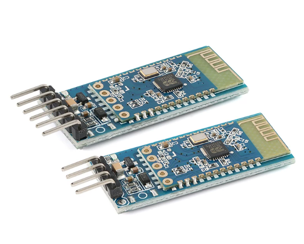

#### 硬件连接

| 串口引脚 | STM32引脚         | 说明         |
| -------- | ----------------- | ------------ |
| RXD      | USART3_TX（PB10） | 串口接收引脚 |
| TXD      | USART3_RX（PB11） | 串口发送引脚 |
| VCC      | 5V                | 电源         |
| GND      | GND               | 公共地       |

#### **CubeMX 配置**

**添加路径：**

- 点击 `项目` -> 点击 `属性` -> 点击 `C/C++ 常规` -> 点击 `路径和符号` -> 在 `包含` 中添加 `Devices/Serial`

  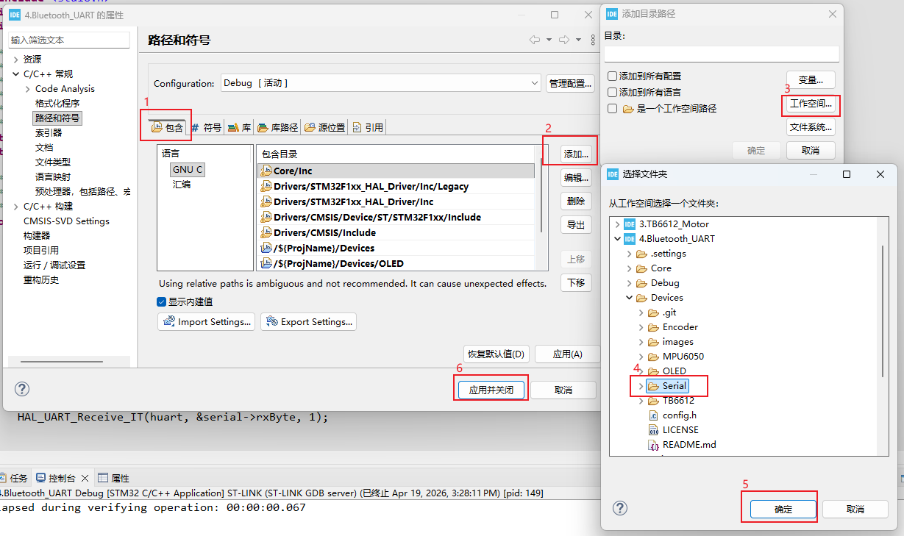

**USART 配置：**

- 选择两个串口引脚（例如PB10、PB11）用于串口发送和接收

- 分别设置为 **USART3_TX** 和 **USART3_RX**

  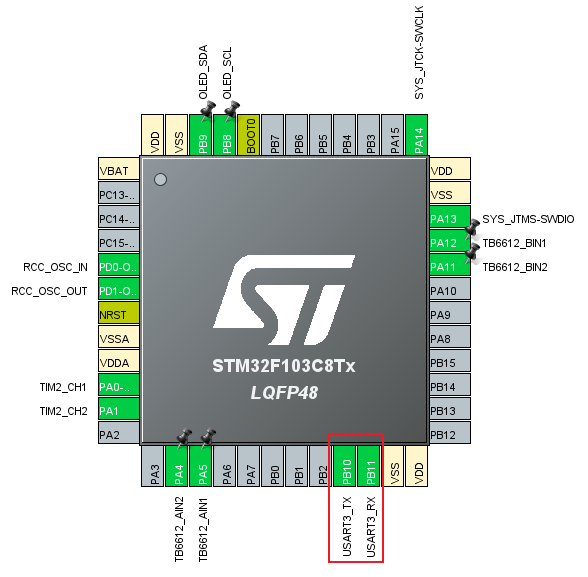

- 找到 **USART3**，将 Mode 设置为 **Asynchronous**

- Baud Rate：**115200**

- Word Length：**8 Bits**、Parity：**None**、Stop Bits：**1**

- 进入 **NVIC Settings**，勾选 **USART3 global interrupt**（开启接收中断）

- 其他选项保持默认配置

  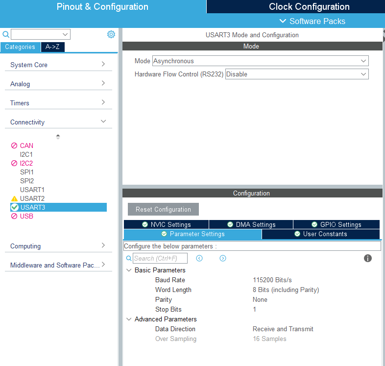

#### config.h 配置

```c
// 使能 Serial 模块
#define DEVICE_SERIAL   1
#if DEVICE_SERIAL
    #include "usart.h"
    #define SERIAL_NUMS     3   // 最多同时使用的串口数量
#endif
```

#### API 接口

```c
void Serial_Init(Serial *serial, UART_HandleTypeDef *huart); 	// 初始化串口实例并启动中断接收
void Serial_Printf(Serial *serial, const char *fmt, ...); 		// 格式化发送字符串（类 printf，阻塞直到发送完成）
bool Serial_Received(Serial *serial); 							// 查询是否收到新字节
unsigned char Serial_Read(Serial *serial); 						// 收到的字节
```

#### 使用示例

```c
#include "Serial.h"

// 声明串口实例（全局）
Serial Serial1;
Serial Serial2;

int main(void)
{
    // 在 HAL_Init 和 MX_USARTx_UART_Init 之后初始化
    Serial_Init(&Serial1, &huart1);
    Serial_Init(&Serial2, &huart2);

    Serial_Printf(&Serial1, "Hello from USART1\r\n");
    Serial_Printf(&Serial2, "Hello from USART2\r\n");

    while (1)
    {
        // 判断 Serial1 是否收到新字节
        if (Serial_Received(&Serial1))
        {
            unsigned char byte = Serial_Read(&Serial1);
            // 将收到的字节回显
            Serial_Printf(&Serial1, "Recv: 0x%02X\r\n", byte);
        }

        // 判断 Serial2 是否收到新字节
        if (Serial_Received(&Serial2))
        {
            unsigned char byte = Serial_Read(&Serial2);
            Serial_Printf(&Serial2, "Recv: 0x%02X\r\n", byte);
        }
    }
}
```

> **注意**：Serial 库内部已实现 `HAL_UART_RxCpltCallback`（覆盖 HAL 弱定义）。  
> 若项目中其他地方也需要该回调，请删除 Serial.c 中的 `HAL_UART_RxCpltCallback`，在自定义回调中手动调用本库内部逻辑。

---

### 6. HCSR04 超声波测距模块

支持 HC-SR04 超声波测距传感器，返回以毫米（mm）为单位的距离。

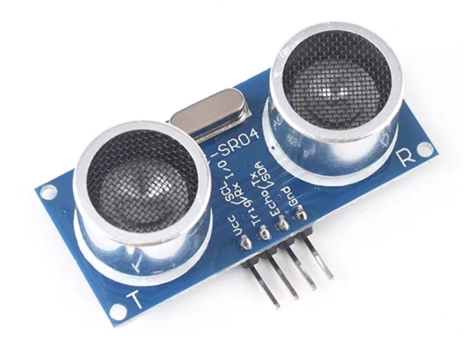

#### 硬件连接

| HCSR04 引脚 | STM32 引脚 | 说明 |
|------------|-----------|------|
| VCC | 5V | 电源（注意：需要 5V 供电） |
| GND | GND | 公共地 |
| Trig | GPIO 输出（PB4） | 触发引脚，输出 ≥10 µs 高电平脉冲 |
| Echo | GPIO 输入（PB3） | 回波引脚，高电平宽度对应往返时间 |

#### CubeMX 配置

**添加路径：**

- 点击 `项目` -> 点击 `属性` -> 点击 `C/C++ 常规` -> 点击 `路径和符号` -> 在 `包含` 中添加 `Devices/HCSR04`

  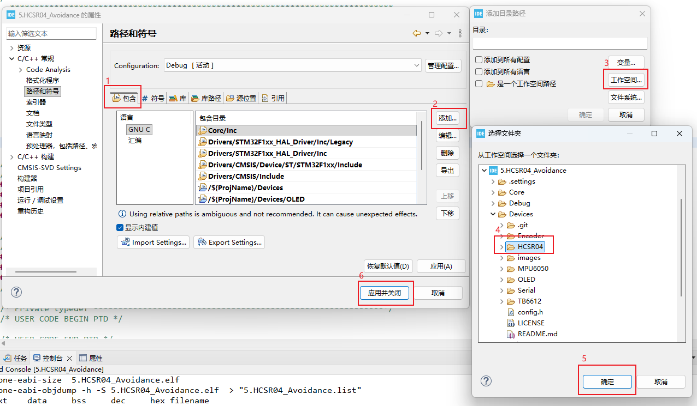

**GPIO 配置：**

- 选择一个 GPIO 引脚（如 PB4）设置为 **GPIO_Output**，User Label 设置为 **HCSR04_TRIG**

- 选择另一个 GPIO 引脚（如 PB3）设置为 **GPIO_Input**，User Label 设置为 **HCSR04_ECHO**

  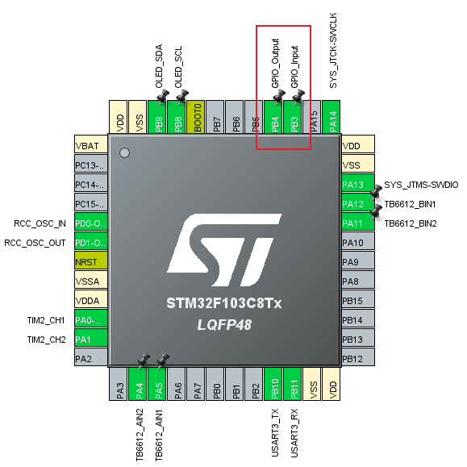

- Trig 引脚：GPIO output level **Low**、GPIO mode **Push Pull**、Speed **Low**

- Echo 引脚：GPIO Pull-up/Pull-down **No pull-up and no pull-down**

  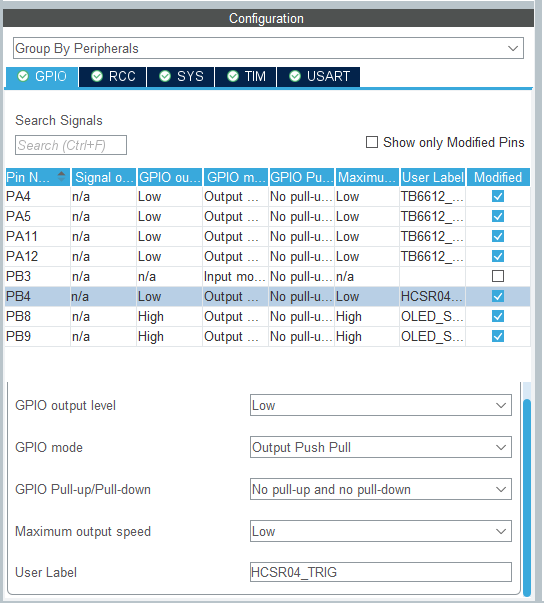

  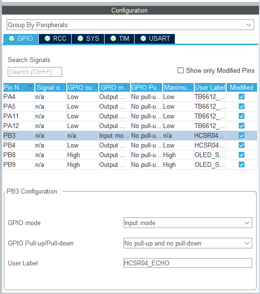

**定时器配置：**

- 选择一个空闲的通用定时器（如 TIM4），设置 **Internal Clock** 模式

- Prescaler (PSC)：**71**（72 MHz / 72 = 1 MHz 定时器时钟）

- Counter Mode：**Up**

- Counter Period (ARR)：**9**（溢出周期 = 10 / 1 MHz = 10 µs）

- 进入 **NVIC Settings**，勾选 **TIMx global interrupt**（开启溢出中断）

  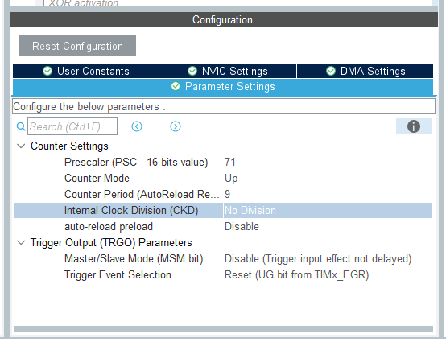

- 其他选项保持默认配置

#### config.h 配置

```c
// 使能 HCSR04 模块
#define DEVICE_HCSR04   1
#if DEVICE_HCSR04
    #include "tim.h"
    #include "gpio.h"
    // 计时定时器
    #define HCSR04_TIM              htim4
    // GPIO 控制宏（CubeMX 生成的引脚名称）
    #define HCSR04_TRIG(x)          HAL_GPIO_WritePin(HCSR04_TRIG_GPIO_Port, HCSR04_TRIG_Pin, (x))
    #define HCSR04_ECHO             HAL_GPIO_ReadPin(HCSR04_ECHO_GPIO_Port, HCSR04_ECHO_Pin)
#endif
```

#### API 接口

```c
void    HCSR04_Init(void);   // 初始化（使能 DWT 微秒延时并启动定时器中断）
int16_t HCSR04_Read(void);   // 阻塞式测距，返回距离（mm），超出量程返回 0
```

#### 使用示例

```c
#include "HCSR04.h"
#include "OLED.h" 

int main(void)
{
    // 初始化 HCSR04
    HCSR04_Init();

    // 初始化 OLED 显示
    OLED_Init();
    OLED_Clear();
    OLED_ShowString(1, 1, "HCSR04 Test");

    while (1)
    {
        int16_t dist = HCSR04_Read();

        OLED_ShowString(2, 1, "Dist:");
        if (dist > 0)
        {
            OLED_ShowNum(2, 7, (uint32_t)dist, 4);
            OLED_ShowString(2, 12, "mm");
        }
        else
        {
            OLED_ShowString(2, 7, "---- ");
        }

        HAL_Delay(60);
    }
}
```

> **注意**：HCSR04 库内部已实现 `HAL_TIM_PeriodElapsedCallback`（覆盖 HAL 弱定义）。
> 若项目中其他地方也需要该回调，请删除 HCSR04.c 中的 `HAL_TIM_PeriodElapsedCallback`，在自定义回调中手动调用本库内部逻辑。

---

### 7. Tracker 五路灰度循迹模块

支持五路灰度循迹传感器，传感器检测到黑线时输出高电平（返回 1），脱离黑线时输出低电平（返回 0），返回偏差值供 PID 等控制算法使用。

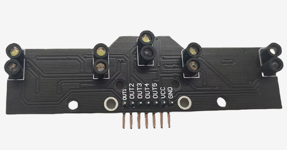

#### 硬件连接

| 循迹引脚 | STM32引脚 | 说明 |
|---------|----------|------|
| L2（最左） | GPIO输入（PA15） | 左侧第2路 |
| L1 | GPIO输入（PB15） | 左侧第1路 |
| M（中间） | GPIO输入（PB14） | 中间路 |
| R1 | GPIO输入（PB13） | 右侧第1路 |
| R2（最右） | GPIO输入（PB12） | 右侧第2路 |
| VCC | 5V               | 电源 |
| GND | GND | 公共地 |

#### CubeMX 配置

**添加路径：**

- 点击 `项目` -> 点击 `属性` -> 点击 `C/C++ 常规` -> 点击 `路径和符号` -> 在 `包含` 中添加 `Devices/Tracker`

  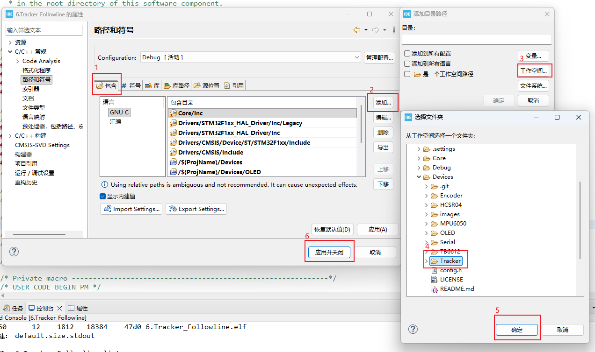

**GPIO 配置：**

- 选择 5 个 GPIO 引脚（例如 PB12、PB13、PB14、PB15、PA15）设置为 **GPIO_Input**

  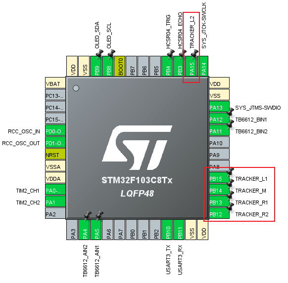

- GPIO Pull-up/Pull-down：根据传感器输出特性选择 **No pull-up and no pull-down** 或 **Pull-Down**

- User Label 分别设置为 **TRACKER_R2**、**TRACKER_R1**、**TRACKER_M**、**TRACKER_L1**、**TRACKER_L2**

  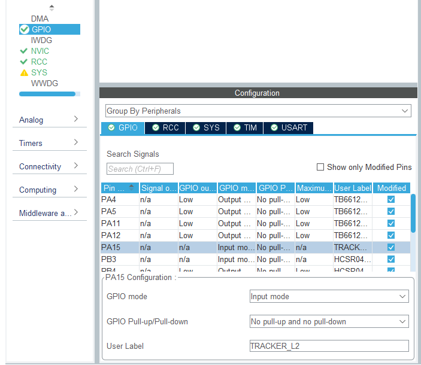

#### config.h 配置

```c
// 使能 Tracker 模块
#define DEVICE_TRACKER  1
#if DEVICE_TRACKER
    #include "gpio.h"
    // 五路循迹引脚读取宏（CubeMX 生成的引脚名称）
    #define L2  HAL_GPIO_ReadPin(TRACKER_L2_GPIO_Port, TRACKER_L2_Pin)
    #define L1  HAL_GPIO_ReadPin(TRACKER_L1_GPIO_Port, TRACKER_L1_Pin)
    #define M   HAL_GPIO_ReadPin(TRACKER_M_GPIO_Port,  TRACKER_M_Pin)
    #define R1  HAL_GPIO_ReadPin(TRACKER_R1_GPIO_Port, TRACKER_R1_Pin)
    #define R2  HAL_GPIO_ReadPin(TRACKER_R2_GPIO_Port, TRACKER_R2_Pin)
#endif
```

#### API 接口

```c
int16_t Tracker_Read(void);  // 读取五路循迹偏差值
```

#### 使用示例

```c
#include "Tracker.h"
#include "TB6612.h"
#include "OLED.h"

int16_t error = 0;
uint8_t flag = 0;

int main(void)
{
    TB6612_Init();

    OLED_Init();
    OLED_Clear();
    OLED_ShowString(1, 1, "Tracker Test");
    OLED_ShowString(2, 1, "Err:");
    OLED_ShowString(3, 1, "State:");

    while (1)
    {
        error = Tracker_Read();
        OLED_ShowSignedFloat(2, 6, error, 1);

        if (error == -4)
        {
          // 非阻塞直角左转
          flag = 1;
        }
        else if (error == 4)
        {
          // 非阻塞直角右转
          flag = 2;
        }
        else if (error == 0)
        {
          // 检测到回到中线退出直角转弯
          flag = 0;
        }

        if (flag == 0)
        {
          // 非直角，普通转弯，比例控制循迹
          OLED_ShowString(3, 7, "Track");
          TB6612_Motor(1000 + error * 100, 1000 - error * 100);
        }
        else if (flag == 1)
        {
          // 直角处理：原地左转
          OLED_ShowString(3, 7, "TurnL");
          TB6612_Motor(-1500, 1500);
        }
        else if (flag == 2)
        {
          // 直角处理：原地右转
          OLED_ShowString(3, 7, "TurnR");
          TB6612_Motor(1500, -1500);
        }
    }
}
```

---

### 8. AT24CXX 存储模块

支持 AT24C01 ~ AT24C512 系列 I2C EEPROM 芯片，默认使用 AT24C02，使用硬件 I2C。更换芯片型号后内存大小、页大小、地址宽度自动适配。

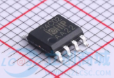

#### 硬件连接

| AT24CXX 引脚 | STM32 引脚 | 说明 |
|-------------|-----------|------|
| VCC | 3.3V | 电源 |
| GND | GND | 公共地 |
| SCL | I2C2_SCL（PB10） | I2C 时钟线 |
| SDA | I2C2_SDA（PB11） | I2C 数据线 |
| A0 | GND | 地址引脚 0（接地） |
| A1 | GND | 地址引脚 1（接地） |
| A2 | GND | 地址引脚 2（接地） |
| WP | GND | 写保护（接地 = 允许写入） |

#### CubeMX 配置

**添加路径：**

- 点击 `项目` -> 点击 `属性` -> 点击 `C/C++ 常规` -> 点击 `路径和符号` -> 在 `包含` 中添加 `Devices/AT24CXX`

  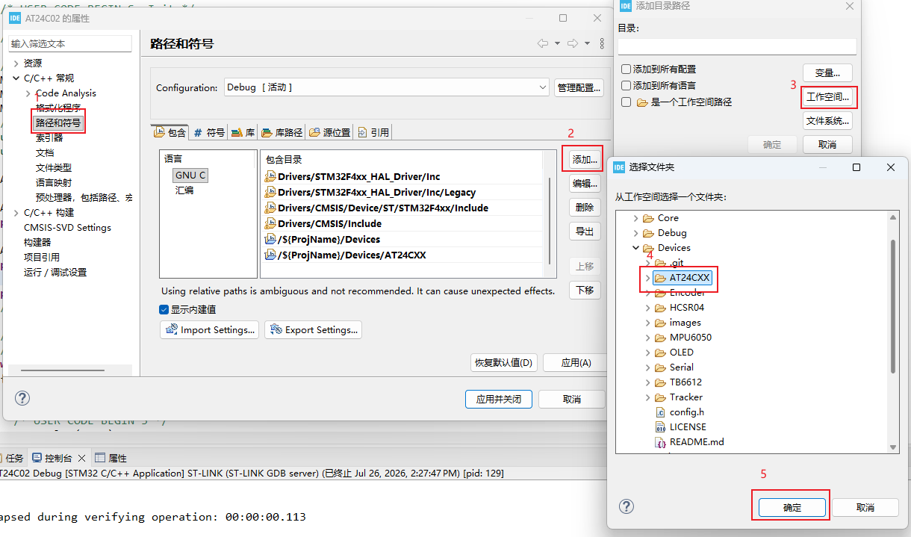

**I2C 配置：**

- 选择两个 I2C 引脚（例如 PB10、PB11）

- 分别设置为 **I2C2_SCL** 和 **I2C2_SDA**

  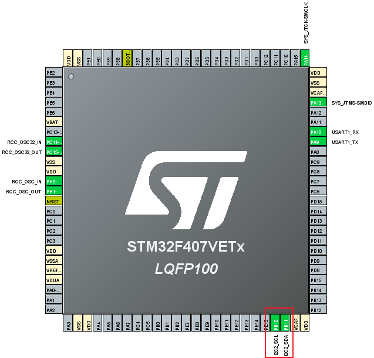

- 找到 **I2C2** 使能 **I2C** 模式

- I2C Speed Mode 设置为 **Standard Mode**（100kHz）

- 其他选项保持默认配置

  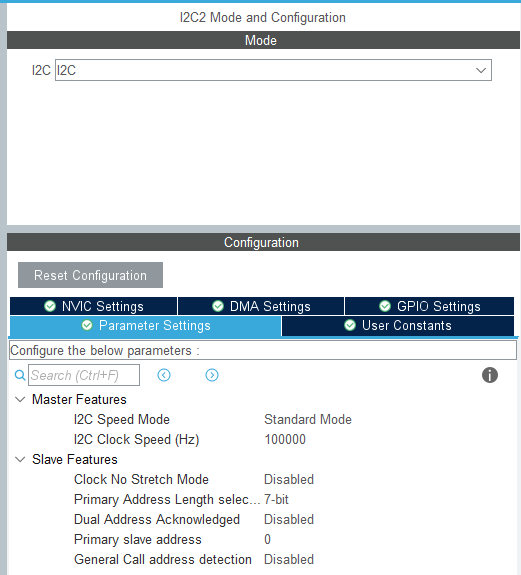

#### config.h 配置

```c
// 使能 AT24CXX 模块
#define DEVICE_AT24CXX  1
#if DEVICE_AT24CXX
    #include "i2c.h"
    // I2C 接口与芯片型号
    #define AT24CXX_I2C         hi2c2
    #define AT24CXX_CHIP        AT24C02
#endif
```

#### API 接口

```c
void     AT24CXX_Init(void);                            // 初始化（检测设备是否存在）

// 单字节读写
void     AT24CXX_WriteByte(uint16_t addr, uint8_t data);       // 写入单个字节
uint8_t  AT24CXX_ReadByte(uint16_t addr);                      // 读取单个字节

// 多字节读写
void     AT24CXX_Write(uint16_t addr, uint8_t *data, uint16_t len);  // 写入（自动跨页）
void     AT24CXX_Read(uint16_t addr, uint8_t *data, uint16_t len);   // 读取

// 整片操作
void     AT24CXX_EraseChip(void);                        // 全片擦除（所有字节写为 0xFF）
```

#### 使用示例

```c
#include "AT24CXX.h"
#include "OLED.h"

int main(void)
{
    uint8_t wbuf[] = "AT24C02 OK!";
    uint8_t rbuf[16] = {0};

    OLED_Init();
    OLED_Clear();

    AT24CXX_Init();

    /* 写入字符串到地址 0x00 */
    AT24CXX_Write(0x00, wbuf, sizeof(wbuf));

    /* 读回验证 */
    AT24CXX_Read(0x00, rbuf, sizeof(wbuf));

    OLED_ShowString(1, 1, "AT24C02 Test");
    OLED_ShowString(2, 1, "Write:");
    OLED_ShowString(2, 8, (char *)wbuf);
    OLED_ShowString(3, 1, "Read:");
    OLED_ShowString(3, 8, (char *)rbuf);

    while (1)
    {
        HAL_Delay(100);
    }
}
```

---

### 9. W25QXX 存储模块

支持 W25Q16 ~ W25Q256 系列 SPI NOR Flash 芯片，默认使用 W25Q16，使用硬件 SPI。更换芯片型号后内存大小自动适配。

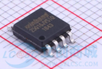

#### 硬件连接

| W25QXX 引脚 | STM32 引脚 | 说明 |
|------------|-----------|------|
| VCC | 3.3V | 电源 |
| GND | GND | 公共地 |
| CS | GPIO 输出（PA4） | 片选（低有效） |
| SCK | SPI1_SCK（PA5） | SPI 时钟线 |
| MISO | SPI1_MISO（PA6） | SPI 主机输入 |
| MOSI | SPI1_MOSI（PA7） | SPI 主机输出 |

#### CubeMX 配置

**添加路径：**

- 点击 `项目` -> 点击 `属性` -> 点击 `C/C++ 常规` -> 点击 `路径和符号` -> 在 `包含` 中添加 `Devices/W25QXX`

  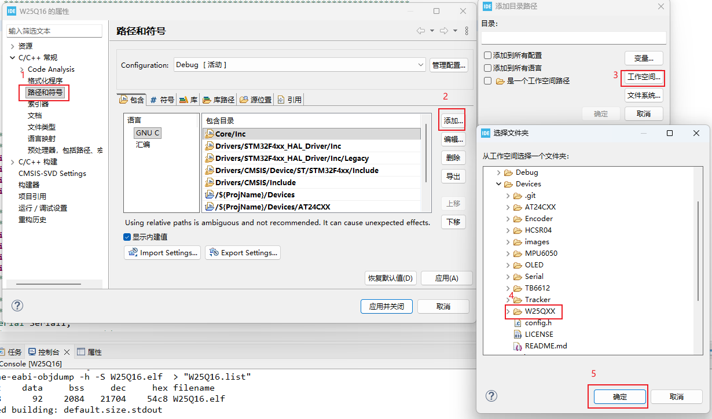

**SPI 配置：**

- 选择三个 SPI 引脚（PA5、PA6、PA7）

- 分别设置为 **SPI1_SCK**、**SPI1_MISO**、**SPI1_MOSI**

  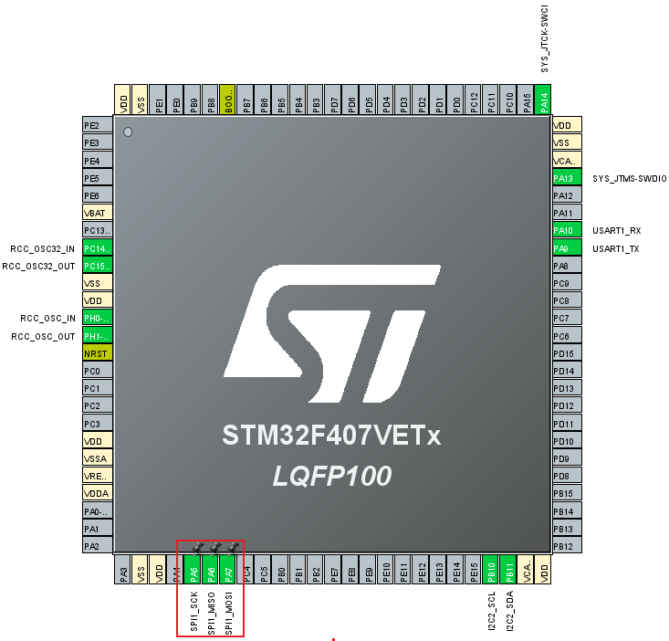

- 找到 **SPI1** 使能 **Full-Duplex Master** 模式

- Data Size：**8 Bits**

- Clock Polarity (CPOL)：**Low**

- Clock Phase (CPHA)：**1 Edge**

- NSS Signal Type：**Software**

- Prescaler：二分频以上即可（W25QXX 最高支持 133MHz）

- 其他选项保持默认配置

  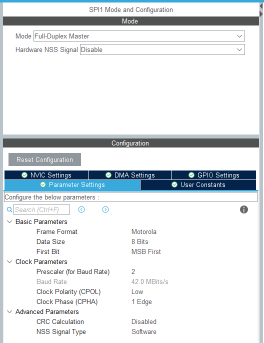

**GPIO 配置（CS 片选）：**

- 选择一个 GPIO 引脚（PA4）设置为 **GPIO_Output**

  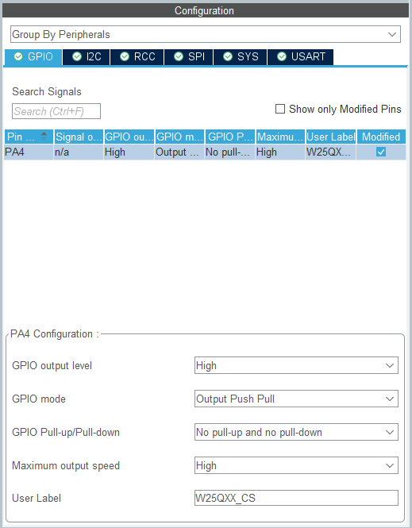

- GPIO output level：**High**（初始不选中）

- GPIO mode：**Push Pull**

- Maximum output speed：**High**

- User Label 设置为 **W25QXX_CS**

- 其他选项保持默认配置

#### config.h 配置

```c
// 使能 W25QXX 模块
#define DEVICE_W25QXX   1
#if DEVICE_W25QXX
    #include "spi.h"
    #include "gpio.h"
    // SPI 接口与芯片型号
    #define W25QXX_SPI          hspi1
    #define W25QXX_CS(x)        HAL_GPIO_WritePin(W25QXX_CS_GPIO_Port, W25QXX_CS_Pin, (x))
    #define W25QXX_CHIP         W25Q16
#endif
```

#### API 接口

```c
void     W25QXX_Init(void);                              // 初始化
void     W25QXX_ReadID(uint8_t *mid, uint16_t *did);     // 读取 JEDEC ID

// 读操作
void     W25QXX_Read(uint32_t addr, uint8_t *data, uint32_t len);  // 读取数据

// 编程（Flash 需先擦除再写入）
void     W25QXX_PageProgram(uint32_t addr, uint8_t *data, uint16_t len); // 页编程（≤256 字节）
void     W25QXX_Write(uint32_t addr, uint8_t *data, uint32_t len);       // 写入（自动擦除+跨页）

// 擦除
void     W25QXX_SectorErase(uint32_t addr);             // 扇区擦除（4KB）
void     W25QXX_BlockErase32K(uint32_t addr);           // 块擦除（32KB）
void     W25QXX_BlockErase64K(uint32_t addr);           // 块擦除（64KB）
void     W25QXX_ChipErase(void);                        // 整片擦除
```

#### 使用示例

```c
#include "W25QXX.h"
#include "OLED.h"

int main(void)
{
    uint8_t mid;
    uint16_t did;
    uint8_t wbuf[] = "W25Q16 OK!";
    uint8_t rbuf[16] = {0};

    OLED_Init();
    OLED_Clear();

    W25QXX_Init();

    /* 读取 JEDEC ID */
    W25QXX_ReadID(&mid, &did);

    OLED_ShowString(1, 1, "W25Q16 Test");
    OLED_ShowString(2, 1, "ID:");
    OLED_ShowHexNum(2, 5, mid, 2);
    OLED_ShowHexNum(2, 8, (uint8_t)(did >> 8), 2);
    OLED_ShowHexNum(2, 11, (uint8_t)(did), 2);

    /* 擦除扇区 0，写入并读回验证 */
    W25QXX_SectorErase(0);
    W25QXX_Write(0x00, wbuf, sizeof(wbuf));
    W25QXX_Read(0x00, rbuf, sizeof(wbuf));

    OLED_ShowString(3, 1, "Read:");
    OLED_ShowString(3, 8, (char *)rbuf);

    while (1)
    {
        HAL_Delay(100);
    }
}
```

---

### 10. AHT20 温湿度传感器模块

支持 AHT20 数字温湿度传感器，使用软件模拟 I2C，返回温度（°C）和相对湿度（%RH）。

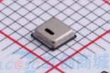

#### 硬件连接

| AHT20 引脚 | STM32 引脚 | 说明 |
|-----------|-----------|------|
| VCC | 3.3V | 电源 |
| GND | GND | 公共地 |
| SCL | GPIO 输出（PE2） | I2C 时钟线（软件模拟） |
| SDA | GPIO 输出（PE3） | I2C 数据线（软件模拟） |

#### CubeMX 配置

**添加路径：**

- 点击 `项目` -> 点击 `属性` -> 点击 `C/C++ 常规` -> 点击 `路径和符号` -> 在 `包含` 中添加 `Devices/AHT20`

  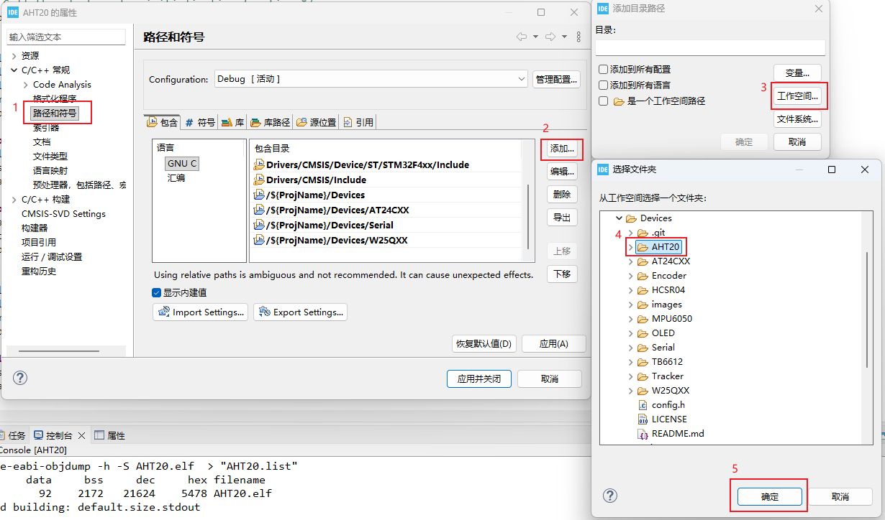

**GPIO 配置：**

- 选择两个 GPIO 引脚（PE2、PE3）

- 设置为 **GPIO_Output**

  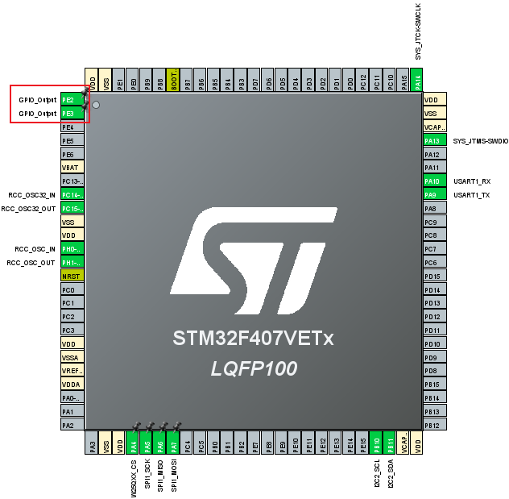

- GPIO output level：SCL 设为 **Push-Pull**，SDA 设为 **Open-Drain**

- GPIO mode：**High**

- Maximum output speed：**High**

- User Label：SCL 引脚设置为 **AHT20_SCL**、SDA 引脚设置为 **AHT20_SDA**

- 其他选项保持默认配置

  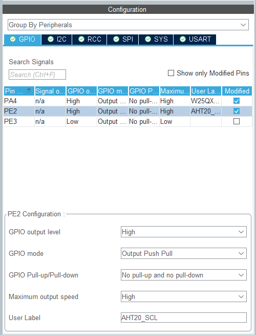

  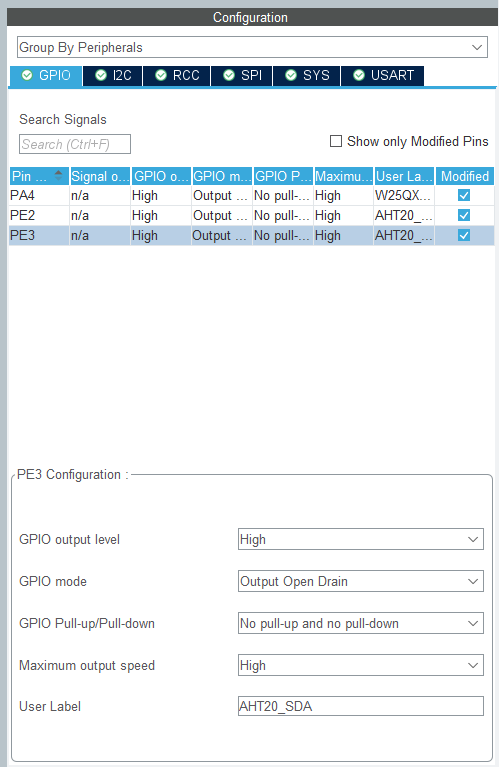

#### config.h 配置

```c
// 使能 AHT20 模块
#define DEVICE_AHT20    1
#if DEVICE_AHT20
    #include "gpio.h"
    // GPIO 控制宏（CubeMX 生成的引脚名称）
    #define AHT20_W_SCL(x)       HAL_GPIO_WritePin(AHT20_SCL_GPIO_Port, AHT20_SCL_Pin, (x))
    #define AHT20_W_SDA(x)       HAL_GPIO_WritePin(AHT20_SDA_GPIO_Port, AHT20_SDA_Pin, (x))
    #define AHT20_R_SDA          HAL_GPIO_ReadPin(AHT20_SDA_GPIO_Port, AHT20_SDA_Pin)
#endif
```

#### API 接口

```c
void     AHT20_Init(void);                       // 初始化（软复位 + 校准）
uint8_t  AHT20_ReadStatus(void);                 // 读取状态字节（bit[3]=1 已校准）
void     AHT20_ReadData(float *temp, float *humi);  // 读取温湿度（°C, %RH）
```

#### 使用示例

```c
#include "AHT20.h"
#include "OLED.h"

int main(void)
{
    float temp, humi;

    OLED_Init();
    OLED_Clear();

    AHT20_Init();

    OLED_ShowString(1, 1, "AHT20 Test");

    while (1)
    {
        AHT20_ReadData(&temp, &humi);

        OLED_ShowString(2, 1, "Temp:");
        OLED_ShowSignedFloat(2, 7, temp, 3);
        OLED_ShowString(2, 14, "C");

        OLED_ShowString(3, 1, "Humi:");
        OLED_ShowSignedFloat(3, 7, humi, 3);
        OLED_ShowString(3, 14, "%");

        HAL_Delay(1000);
    }
}
```

---

### 11. ST7789 显示模块

支持 240×320 分辨率 ST7789V 驱动芯片 TFT LCD 显示屏，使用硬件 SPI + DMA 传输，RGB565 颜色格式。

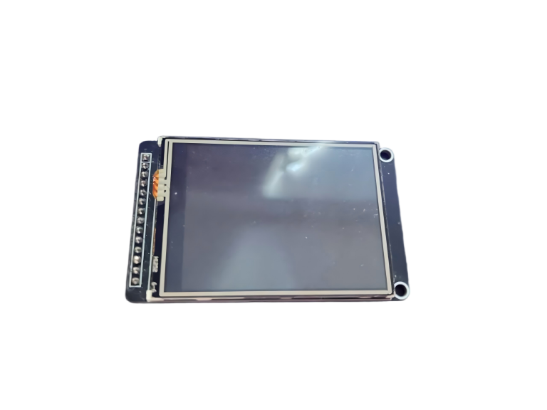

#### 硬件连接

| ST7789 引脚 | STM32 引脚 | 说明 |
|------------|-----------|------|
| VCC | 3.3V | 电源 |
| GND | GND | 公共地 |
| SCK | SPI3_SCK（PB3） | SPI 时钟线 |
| MOSI | SPI3_MOSI（PB5） | SPI 主机输出 |
| MISO | SPI3_MISO（PB4） | SPI 主机输入（未使用） |
| CS | GPIO 输出（PA15） | 片选（低有效） |
| DC | GPIO 输出（PB0） | 数据/命令选择（高=数据） |
| RST | GPIO 输出（PC7） | 硬件复位（低有效） |
| BLED | GPIO 输出（PB1） | 背光控制（高电平点亮） |

#### CubeMX 配置

**添加路径：**

- 点击 `项目` -> 点击 `属性` -> 点击 `C/C++ 常规` -> 点击 `路径和符号` -> 在 `包含` 中添加 `Devices/ST7789`

  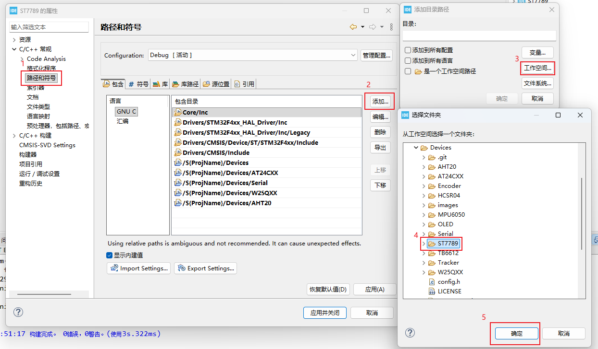

**SPI 配置：**

- 选择三个 SPI 引脚（PB3、PB4、PB5）

- 分别设置为 **SPI3_SCK**、**SPI3_MISO**、**SPI3_MOSI**

  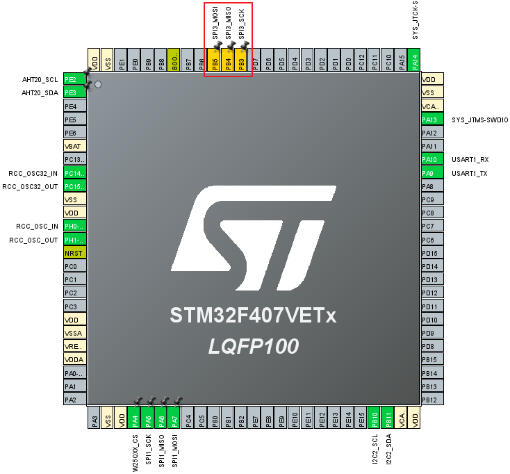

- 找到 **SPI3** 使能 **Full-Duplex Master** 模式

- Data Size：**8 Bits**

- Clock Polarity (CPOL)：**Low**

- Clock Phase (CPHA)：**1 Edge**

- NSS Signal Type：**Software**

- Prescaler：四分频以上（ST7789 最高支持 62.5MHz）

- 其他选项保持默认配置

  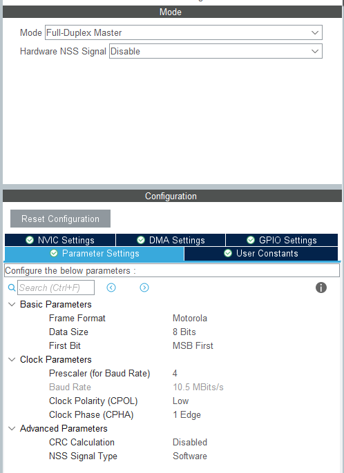

**DMA 配置：**

- 进入 **DMA Settings** 选项卡，添加 **SPI3_TX**

- DMA Request：**SPI3_TX**

- Direction：**Memory To Peripheral**

- Priority：**High**

- Mode：**Normal**

- Data Width：**Byte**

- 其他选项保持默认配置

  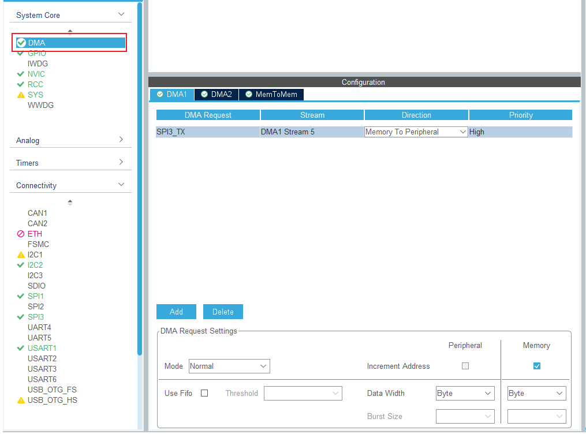

**GPIO 配置：**

- 选择 4 个 GPIO 引脚（PA15、PB0、PC7、PB1）设置为 **GPIO_Output**

  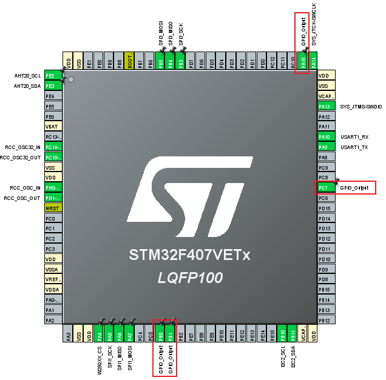

- GPIO output level：**Push-Pull**

- GPIO mode：CS 设为 **High**（初始不选中）、DC/RST/BLED 设为 **High**

- Maximum output speed：**High**

- User Label 分别设置为 **ST7789_CS**、**ST7789_DC**、**ST7789_RST**、**ST7789_BLED**

- 其他选项保持默认配置

  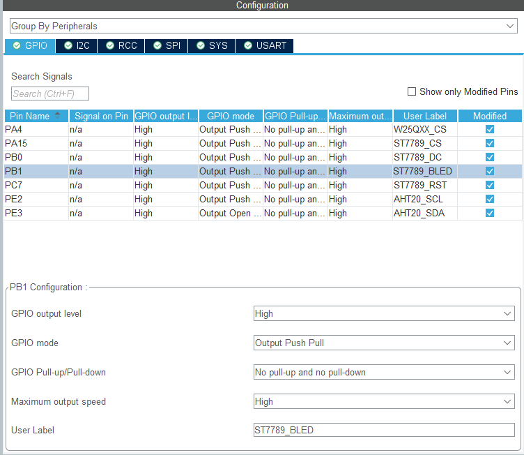

> **注意**：PB3 默认是 JTDO（JTAG 调试），需要在 SYS → Debug 中选择 **Serial Wire** 来释放 PB3 给 SPI3 使用。

#### config.h 配置

```c
// 使能 ST7789 模块
#define DEVICE_ST7789   1
#if DEVICE_ST7789
    #include "spi.h"
    #include "gpio.h"
    #include "dma.h"
    // SPI 接口与控制引脚
    #define ST7789_SPI          hspi3
    #define ST7789_CS(x)        HAL_GPIO_WritePin(ST7789_CS_GPIO_Port, ST7789_CS_Pin, (x))
    #define ST7789_DC(x)        HAL_GPIO_WritePin(ST7789_DC_GPIO_Port, ST7789_DC_Pin, (x))
    #define ST7789_RST(x)       HAL_GPIO_WritePin(ST7789_RST_GPIO_Port, ST7789_RST_Pin, (x))
    #define ST7789_BLED(x)      HAL_GPIO_WritePin(ST7789_BLED_GPIO_Port, ST7789_BLED_Pin, (x))
#endif
```

#### API 接口

```c
// 初始化
void     ST7789_Init(void);                              // 初始化（复位 + 寄存器配置）

// 绘图
void     ST7789_Clear(uint16_t color);                   // 全屏填充
void     ST7789_DrawPoint(uint16_t x, uint16_t y, uint16_t color);   // 画单个像素点
void     ST7789_FillRect(uint16_t x, uint16_t y, uint16_t w, uint16_t h, uint16_t color);  // 填充矩形

// 文字与图片
void     ST7789_WriteString(uint16_t x, uint16_t y, char *str, uint16_t color);     // 写字符串（8×16 字体）
void     ST7789_DrawImage(uint16_t x, uint16_t y, uint16_t w, uint16_t h, const uint16_t *data);    // 显示图片（RGB565）

// 底层接口
void     ST7789_SetWindow(uint16_t x, uint16_t y, uint16_t w, uint16_t h);    // 设置像素写入窗口
void     ST7789_WriteData(const uint8_t *data, uint32_t len);                  // DMA 批量写入像素
```

#### 使用示例

```c
#include "ST7789.h"
#include "OLED.h"

int main(void)
{
    ST7789_Init();
    ST7789_Clear(ST7789_COLOR_BLACK);

    /* 显示字符串 */
    ST7789_WriteString(10, 10, "STM32 HAL", ST7789_COLOR_WHITE);
    ST7789_WriteString(10, 30, "ST7789 LCD", ST7789_COLOR_YELLOW);

    /* 画矩形 */
    ST7789_FillRect(50, 60, 100, 80, ST7789_COLOR_BLUE);

    /* 画点 */
    ST7789_DrawPoint(100, 100, ST7789_COLOR_RED);

    while (1)
    {
        HAL_Delay(100);
    }
}
```

---

### 12. XPT2046 触摸模块

支持 XPT2046 四线电阻触摸控制器，使用软件模拟 SPI，返回映射到屏幕分辨率的触摸坐标。

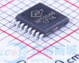

#### 硬件连接

| XPT2046 引脚 | STM32 引脚 | 说明 |
|-------------|-----------|------|
| VCC | 3.3V | 电源 |
| GND | GND | 公共地 |
| CLK | GPIO 输出（PE10） | SPI 时钟线（软件模拟） |
| CS | GPIO 输出（PE12） | 片选（低有效） |
| DIN | GPIO 输出（PE13） | SPI 主机输出 |
| DO | GPIO 输入（PE14） | SPI 主机输入 |
| IRQ | GPIO 输入（PE15） | 触摸中断（低有效） |

#### CubeMX 配置

**添加路径：**

- 点击 `项目` -> 点击 `属性` -> 点击 `C/C++ 常规` -> 点击 `路径和符号` -> 在 `包含` 中添加 `Devices/XPT2046`

  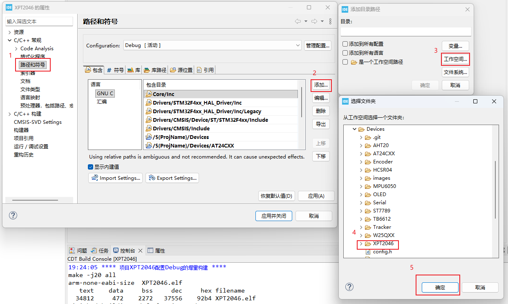

**GPIO 配置：**

- 选择 3 个输出引脚（PE10/PE12/PE13）和 2 个输入引脚（PE14/PE15）

  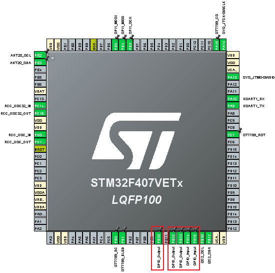

- CLK/DIN 引脚：GPIO output level **Push-Pull**、GPIO mode **Low**、Speed **High**
- CS 引脚：GPIO output level **Push-Pull**、GPIO mode **High**（初始不选中）、Speed **High**
- User Label：**XPT2046_CLK**、**XPT2046_CS**、**XPT2046_DIN**

  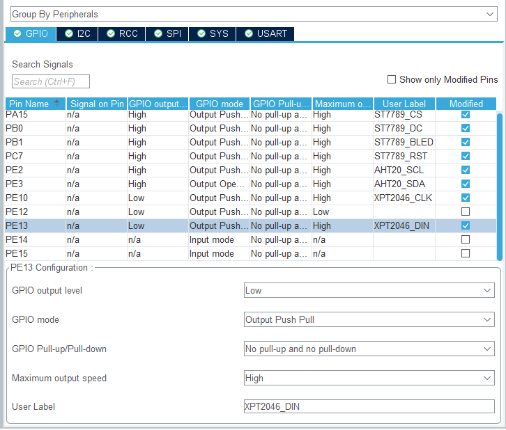

  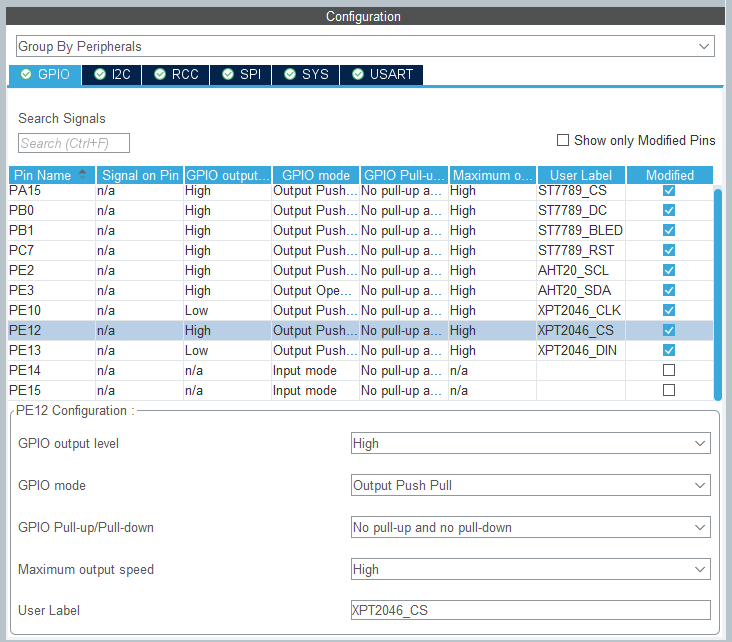

- DO 引脚：GPIO mode **Input**、Pull-up **Pull-up**
- IRQ 引脚：GPIO mode **Input**、Pull-up **Pull-up**
- User Label：**XPT2046_DO**、**XPT2046_IRQ**

  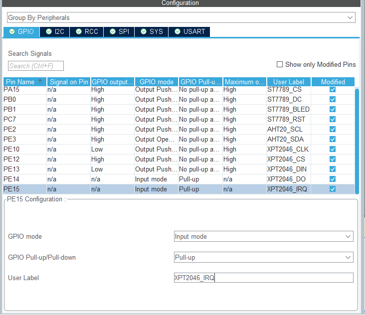

- 其他选项保持默认配置

#### config.h 配置

```c
// 使能 XPT2046 模块
#define DEVICE_XPT2046  1
#if DEVICE_XPT2046
    #include "gpio.h"
    // GPIO 控制宏（CubeMX 生成的引脚名称）
    #define XPT2046_CLK(x)      HAL_GPIO_WritePin(XPT2046_CLK_GPIO_Port, XPT2046_CLK_Pin, (x))
    #define XPT2046_CS(x)       HAL_GPIO_WritePin(XPT2046_CS_GPIO_Port, XPT2046_CS_Pin, (x))
    #define XPT2046_DIN(x)      HAL_GPIO_WritePin(XPT2046_DIN_GPIO_Port, XPT2046_DIN_Pin, (x))
    #define XPT2046_DO          HAL_GPIO_ReadPin(XPT2046_DO_GPIO_Port, XPT2046_DO_Pin)
    #define XPT2046_IRQ         HAL_GPIO_ReadPin(XPT2046_IRQ_GPIO_Port, XPT2046_IRQ_Pin)
#endif
```

#### API 接口

```c
void     XPT2046_Init(void);                       // 初始化
void     XPT2046_SetRotation(uint8_t rotation);    // 设置方向（与 ST7789 同步）
uint8_t  XPT2046_IsPressed(void);                  // 是否按下（1 = 按下）
uint8_t  XPT2046_ReadXY(uint16_t *x, uint16_t *y); // 读取坐标（内部已检查按下，返回 1=有效）
```

#### 使用示例

```c
#include "ST7789.h"
#include "XPT2046.h"

int main(void)
{
    uint16_t tx, ty;
    char buf[32];

    ST7789_Init();
    XPT2046_Init();

    ST7789_Clear(ST7789_COLOR_BLACK);
    ST7789_WriteString(10, 10, "Touch Test", ST7789_COLOR_WHITE);

    while (1)
    {
        if (XPT2046_ReadXY(&tx, &ty))
        {
            /* 中央显示坐标 */
            sprintf(buf, "X:%-3u Y:%-3u", tx, ty);
            ST7789_FillRect(100, 110, 120, 16, ST7789_COLOR_BLACK);
            ST7789_WriteString(100, 110, buf, ST7789_COLOR_YELLOW);

            /* 在触摸点画圆点 */
            ST7789_FillRect(tx - 1, ty - 1, 3, 3, ST7789_COLOR_RED);
        }
    }
}
```

### 13. ICM42688P 六轴传感器模块

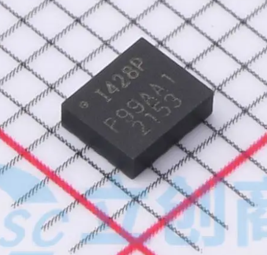

支持三轴陀螺仪和三轴加速度计的 ICM-42688-P 传感器，使用软件 SPI。

#### 硬件连接

| ICM-42688-P 引脚 | STM32 引脚 | 说明                   |
| ---------------- | ---------- | ---------------------- |
| AP_SCL           | PC0        | SPI 时钟线（软件模拟） |
| AP_CS            | PC3        | 片选（低有效）         |
| AP_SDO           | PC4        | SPI 主机输入           |
| AP_SDA           | PC5        | SPI 主机输出           |
| VDD / VDDIO      | 3.3V       | 电源                   |
| GND              | GND        | 公共地                 |

#### CubeMX 配置

**添加路径：**

- 点击 `项目` -> 点击 `属性` -> 点击 `C/C++ 常规` -> 点击 `路径和符号` -> 在 `包含` 中添加 `Devices/ICM42688P`


**GPIO 配置：**

- 选择 3 个输出引脚（PC0/PC3/PC5）和 1 个输入引脚（PC4）

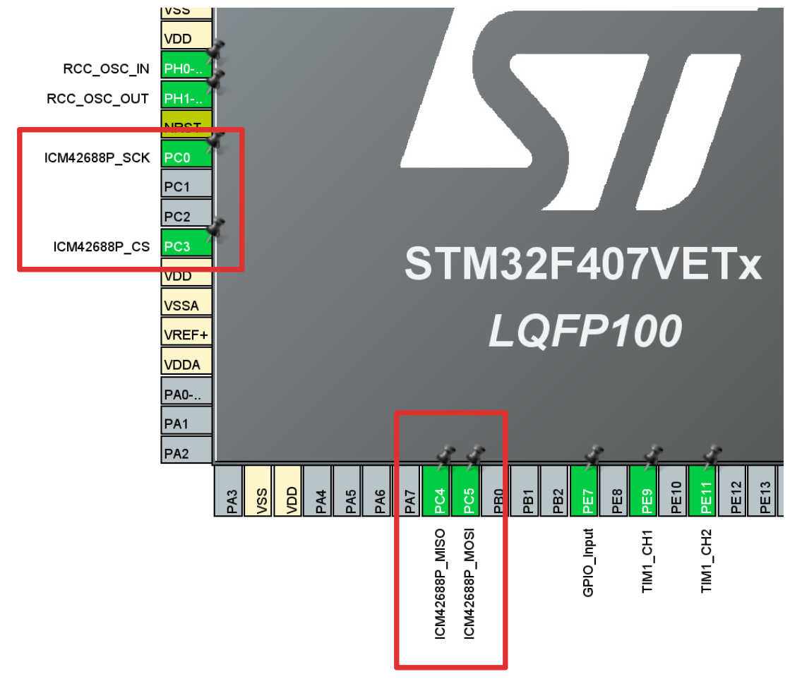

- SCL/SDA 引脚：GPIO mode **Push-Pull**、GPIO output level **Low**、Speed **High**
- CS 引脚：GPIO mode **Push-Pull**、GPIO output level **High**（初始不选中）、Speed **High**
- SDO 引脚：GPIO mode **Input**、**No pull-up and no pull-down**
- User Label：**ICM42688P_SCK**、**ICM42688P_MOSI**、**ICM42688P_CS**、**ICM42688P_MISO**


- 其他选项保持默认配置

#### config.h 配置

~~~c
// 使能 ICM42688P 模块
#define DEVICE_ICM42688P  1
#if DEVICE_ICM42688P
    #include "gpio.h"
	// GPIO 控制宏（CubeMX 生成的引脚名称）
    #define ICM42688P_SCK(x)           HAL_GPIO_WritePin(ICM42688P_SCK_GPIO_Port, ICM42688P_SCK_Pin, (x))
    #define ICM42688P_CS(x)            HAL_GPIO_WritePin(ICM42688P_CS_GPIO_Port, ICM42688P_CS_Pin, (x))
    #define ICM42688P_MISO             HAL_GPIO_ReadPin(ICM42688P_MISO_GPIO_Port, ICM42688P_MISO_Pin)
    #define ICM42688P_MOSI(x)          HAL_GPIO_WritePin(ICM42688P_MOSI_GPIO_Port, ICM42688P_MOSI_Pin, (x))
#endif
~~~

#### API 接口

~~~C
uint8_t  ICM42688P_Init(void);                                      // 初始化 ICM-42688-P
uint8_t  ICM42688P_ReadID(void);                                    // 读取 WHO_AM_I，正常值为 0x47
uint8_t  ICM42688P_ReadRaw(ICM42688P_RawData_t *raw_data);          // 读取温度、加速度和角速度原始值
uint8_t  ICM42688P_ReadData(ICM42688P_Data_t *data);                // 读取加速度 g、角速度 dps 和温度 °C
~~~

#### 使用示例

~~~C
#include "ICM42688P.h"
#include <stdio.h>

//自行将 printf 重定向到串口

int main(void)
{
    ICM42688P_Data_t data;

    ICM42688P_Init();

    while (1)
    {
        ICM42688P_ReadData(&data);
        printf("Acc[g]x1000=%ld,%ld,%ld Gyro[dps]x1000=%ld,%ld,%ld Temp[C]x1000=%ld\r\n",
               (long)(data.accel_g.x * 1000.0f),
               (long)(data.accel_g.y * 1000.0f),
               (long)(data.accel_g.z * 1000.0f),
               (long)(data.gyro_dps.x * 1000.0f),
               (long)(data.gyro_dps.y * 1000.0f),
               (long)(data.gyro_dps.z * 1000.0f),
               (long)(data.temperature_c * 1000.0f));
        HAL_Delay(100);
    }
}
~~~

---

### 14. SDCard 存储模块

适配 STM32F407VET6 的 SD 卡存储模块，使用 SDIO 4-bit 总线并内置 FatFs R0.12c。应用层可直接调用文件写入和读取接口，底层逻辑块接口仍然保留。

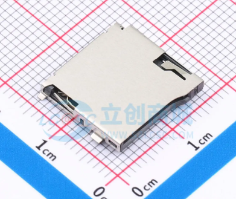

#### 硬件连接

| SD 卡信号 | STM32F407VET6 引脚 | 说明 |
|----------|--------------------|------|
| VCC | 3.3V | 电源 |
| GND | GND | 公共地 |
| D0 | PC8 / SDIO_D0 | 数据位 0 |
| D1 | PC9 / SDIO_D1 | 数据位 1 |
| D2 | PC10 / SDIO_D2 | 数据位 2 |
| D3 | PC11 / SDIO_D3 | 数据位 3 |
| CLK | PC12 / SDIO_CK | 时钟 |
| CMD | PD2 / SDIO_CMD | 命令 |

#### CubeMX 配置

**添加路径：**

- 点击 `项目` -> 点击 `属性` -> 点击 `C/C++ 常规` -> 点击 `路径和符号`，在 `包含` 和 `源位置` 中添加 `Devices/SDCard`。
- 如果工程不会自动收集源文件，将 `SDCard.c`、`ff.c`、`diskio.c` 加入编译。

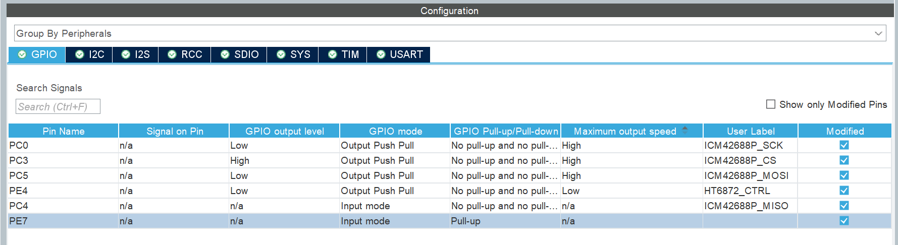

**SDIO 配置：**

- 在 **Connectivity** 中打开 **SDIO**，模式选择 **SD 4 bits Wide bus**。
- 引脚保持为 PC8/SDIO_D0、PC9/SDIO_D1、PC10/SDIO_D2、PC11/SDIO_D3、PC12/SDIO_CK、PD2/SDIO_CMD。

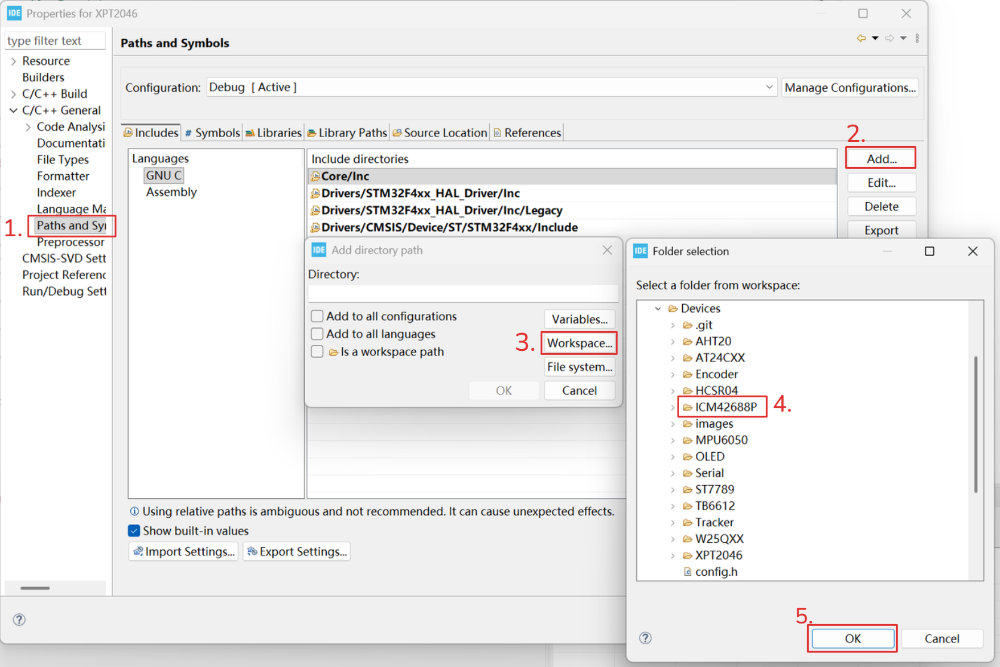

- Clock edge：**Rising Edge**
- Clock bypass：**Disable**
- Clock power save：**Disable**
- Hardware flow control：**Disable**
- SDIO Clock divider：**0**
- GPIO 保持参考工程配置：**Alternate Function Push Pull**、**No pull-up and no pull-down**、**Very High**、**AF12_SDIO**。
- 参考工程使用 8 MHz HSE、PLLM=4、PLLN=168、PLLQ=7，SDIO 使用的 48 MHz 时钟为 48 MHz。
- 其他选项保持默认配置。

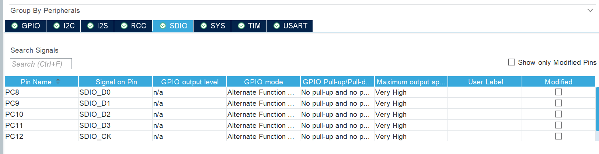

驱动中的时钟沿、Bypass、Power Save、Hardware Flow Control、Clock Divider 和总线宽度均按已调通工程保留。`SDCard_Init()` 会调用 `HAL_SD_Init()` 完成初始化，因此应用层无需另外调用 `MX_SDIO_SD_Init()`。

#### config.h 配置

```c
// 使能 SDCard 模块
#define DEVICE_SDCARD  1
#if DEVICE_SDCARD
    #include "sdio.h"
    #define SDCARD_HANDLE              hsd
    #define SDCARD_INSTANCE            SDIO
    #define SDCARD_CLOCK_EDGE          SDIO_CLOCK_EDGE_RISING
    #define SDCARD_CLOCK_BYPASS        SDIO_CLOCK_BYPASS_DISABLE
    #define SDCARD_CLOCK_POWER_SAVE    SDIO_CLOCK_POWER_SAVE_DISABLE
    #define SDCARD_HARDWARE_FLOW       SDIO_HARDWARE_FLOW_CONTROL_DISABLE
    #define SDCARD_CLOCK_DIVIDER       0U
    #define SDCARD_BUS_WIDTH           SDIO_BUS_WIDE_4B
#endif
```

#### API 接口

```c
// 应用层文件接口
FRESULT         SDCard_WriteFile(const char *path, const void *data,
                                 uint32_t size, uint32_t *bytes_written);  // 创建或覆盖文件并写入
FRESULT         SDCard_ReadFile(const char *path, void *data,
                                uint32_t size, uint32_t *bytes_read);      // 从文件开头读取

// 文件系统接口
FRESULT         SDCard_Mount(void);                                       // 挂载文件系统
FRESULT         SDCard_Unmount(void);                                     // 卸载文件系统
uint8_t         SDCard_IsMounted(void);                                   // 查询挂载状态
FRESULT         SDCard_RemoveFile(const char *path);                      // 删除文件
FRESULT         SDCard_GetSpace(uint32_t *total_kb, uint32_t *free_kb);   // 查询容量

// 原始块设备接口
SDCard_Status_t SDCard_Init(void);                                        // 初始化 SD 卡
SDCard_Status_t SDCard_GetInfo(SDCard_Info_t *info);                      // 获取卡信息
SDCard_Status_t SDCard_ReadBlocks(uint32_t block, uint8_t *data,
                                  uint32_t block_count);                   // 读取逻辑块
SDCard_Status_t SDCard_WriteBlocks(uint32_t block, const uint8_t *data,
                                   uint32_t block_count);                  // 写入逻辑块
```

#### 使用示例

```c
#include "SDCard.h"

int main(void)
{
    const uint8_t text[] = "SDCard test OK!\r\n";
    uint8_t data[64];
    uint32_t bytes_written;
    uint32_t bytes_read;

    if (SDCard_WriteFile("0:/SDTEST.TXT", text, sizeof(text) - 1U,
                         &bytes_written) == FR_OK)
    {
        if (SDCard_ReadFile("0:/SDTEST.TXT", data, sizeof(data) - 1U,
                            &bytes_read) == FR_OK)
        {
            data[bytes_read] = '\0';
        }
    }

    SDCard_Unmount();

    while (1)
    {
    }
}
```

`SDCard_WriteFile()` 使用创建并覆盖模式。当前 FatFs 配置支持 FAT16/FAT32、512 字节扇区和 8.3 短文件名，不支持 exFAT、长文件名和在单片机上格式化；请先在电脑上格式化 SD 卡。连续读写完成后，在断电或拔卡前调用 `SDCard_Unmount()`。

---

### 15. ES8388 音频编解码模块

适配 STM32F407VET6 的 ES8388 音频编解码器，使用 I2C1 配置寄存器，使用 I2S2 收发 8 kHz、16 位、双声道 PCM。支持板载麦克风、耳机麦克风、耳机和经 HT6872 驱动的双扬声器，并提供内存播放、回调流播放和缓冲区录音接口。

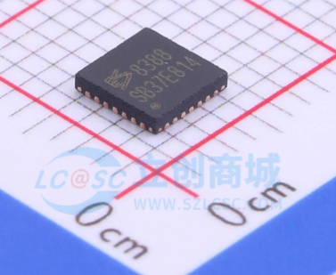

#### 硬件连接

| ES8388/音频信号 | STM32F407VET6 引脚 | 说明 |
|----------------|--------------------|------|
| CCLK | PB6 / I2C1_SCL | 控制时钟 |
| CDATA | PB7 / I2C1_SDA | 控制数据，ES8388 7 位地址为 `0x10` |
| LRCK | PB12 / I2S2_WS | 左右声道时钟 |
| SCLK | PB13 / I2S2_CK | 串行位时钟 |
| ASDOUT | PB14 / I2S2_ext_SD | ES8388 ADC 数据进入 MCU |
| DSDIN | PB15 / I2S2_SD | MCU 数据进入 ES8388 DAC |
| MCLK | PC6 / I2S2_MCK | 主时钟 |
| HT6872_CTRL | PE4 | 双通道扬声器功放使能，高电平有效 |

板载麦克风使用 LIN1/RIN1 差分输入，耳机麦克风使用 LIN2/RIN2，耳机使用 LOUT1/ROUT1，双扬声器通过 LOUT2/ROUT2 连接 HT6872。

#### CubeMX 配置

**添加路径：**

- 点击 `项目` -> 点击 `属性` -> 点击 `C/C++ 常规` -> 点击 `路径和符号`，在 `包含` 和 `源位置` 中添加 `Devices/ES8388`。
- 如果工程不会自动收集源文件，将 `ES8388.c` 加入编译。

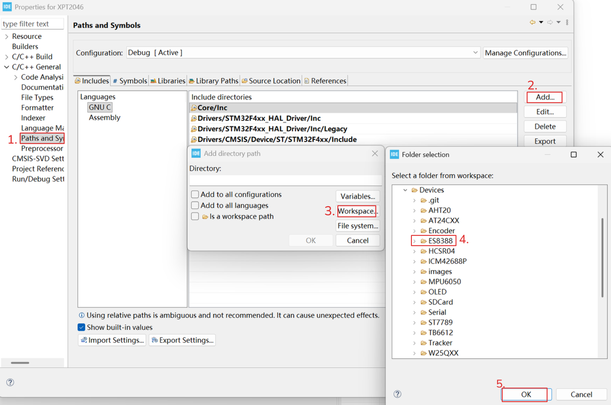

**I2C1 配置：**

- Clock Speed：**100000 Hz**
- Duty Cycle：**2**
- Addressing Mode：**7-bit**
- PB6/I2C1_SCL、PB7/I2C1_SDA：**Alternate Function Open Drain**、**No pull-up and no pull-down**、**Very High**、**AF4_I2C1**

**I2S2 配置：**

- Mode：**Master Transmit**
- Standard：**Philips**
- Data and Frame Format：**16 Bits Data on 16 Bits Frame**
- Master Clock Output：**Enable**
- Audio Frequency：**8 kHz**（参考工程实际约 7.978 kHz）
- Clock Polarity：**Low**
- Clock Source：**PLL**
- Full Duplex Mode：**Enable**
- PLLI2S：**PLLI2SN=192**、**PLLI2SR=2**
- PB12/I2S2_WS、PB13/I2S2_CK、PB15/I2S2_SD、PC6/I2S2_MCK 使用对应 AF5；PB14/I2S2_ext_SD 使用 AF6。GPIO 均为推挽复用、无上下拉、Low Speed。

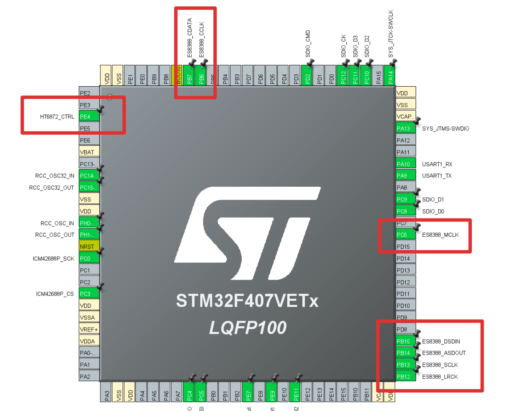

**HT6872 配置：**

- PE4 配置为 **GPIO Output / Push Pull / No pull / Low Speed**。
- 输出初始电平必须为低。驱动不会初始化该引脚，只使用 `main.h` 中 CubeMX 生成的 `HT6872_CTRL_Pin` 和 `HT6872_CTRL_GPIO_Port`。

驱动不会调用 `MX_I2C1_Init()`、`MX_I2S2_Init()` 或 `MX_GPIO_Init()`，请在 `ES8388_Init()` 前完成 CubeMX 外设初始化。寄存器值和顺序保留自已调通工程的 `test/es8388.c`、`test/speaker_test.c`：耳机只打开 LOUT1/ROUT1（`DACPOWER=0x30`），扬声器只打开 LOUT2/ROUT2（`DACPOWER=0x0C`）。

#### config.h 配置

```c
// 使能 ES8388 模块
#define DEVICE_ES8388  1
#if DEVICE_ES8388
    #include "i2c.h"
    #include "i2s.h"
    #include "gpio.h"
    #define ES8388_I2C_HANDLE          hi2c1
    #define ES8388_I2S_HANDLE          hi2s2
    #define ES8388_SAMPLE_RATE_HZ      8000U
    #define ES8388_AUDIO_TIMEOUT_MS    2000U
    #define ES8388_AMP_ENABLE()        HAL_GPIO_WritePin(HT6872_CTRL_GPIO_Port, HT6872_CTRL_Pin, GPIO_PIN_SET)
    #define ES8388_AMP_DISABLE()       HAL_GPIO_WritePin(HT6872_CTRL_GPIO_Port, HT6872_CTRL_Pin, GPIO_PIN_RESET)
#endif
```

#### API 接口

```c
ES8388_Status_t ES8388_Init(void);                                        // 初始化，输入输出保持关闭
ES8388_Status_t ES8388_DeInit(void);                                      // 静音并复位
ES8388_Status_t ES8388_SetInput(ES8388_Input_t input);                    // 选择录音输入并关闭输出
ES8388_Status_t ES8388_SetOutput(ES8388_Output_t output);                 // 选择播放输出并关闭输入
ES8388_Status_t ES8388_SetInputGain(uint8_t gain_db);                     // ADC 增益 0~24 dB，步进 3 dB
ES8388_Status_t ES8388_SetOutputVolume(ES8388_Output_t output,
                                       uint8_t volume);                   // 模拟音量 0x00~0x1E
ES8388_Status_t ES8388_SetMute(uint8_t muted);                            // 当前输出静音控制
ES8388_Status_t ES8388_Transmit(const int16_t *samples,
                                uint32_t word_count,
                                uint32_t timeout_ms);                      // 底层 PCM 发送
ES8388_Status_t ES8388_Receive(int16_t *samples, uint32_t word_count,
                               uint32_t timeout_ms);                       // 底层 PCM 接收
ES8388_Status_t ES8388_PlayBuffer(const int16_t *samples,
                                  uint32_t word_count,
                                  ES8388_Output_t output,
                                  uint32_t timeout_ms);                    // 播放数组或 malloc 内存
ES8388_Status_t ES8388_PlayStream(ES8388_ReadCallback_t read_callback,
                                  void *context, int16_t *work_buffer,
                                  uint32_t work_words,
                                  ES8388_Output_t output,
                                  uint32_t timeout_ms);                    // 回调流播放
ES8388_Status_t ES8388_RecordBuffer(int16_t *samples, uint32_t word_count,
                                    ES8388_Input_t input,
                                    uint32_t timeout_ms);                  // 录音到用户缓冲区
```

#### 使用示例

```c
#include "ES8388.h"

extern const int16_t AudioPcm[];       // 左、右、左、右排列的双声道 PCM
extern const uint32_t AudioPcmWords;   // 16 位字数，不是字节数

int main(void)
{
    HAL_Init();
    SystemClock_Config();
    MX_GPIO_Init();
    MX_I2C1_Init();
    MX_I2S2_Init();

    if (ES8388_Init() == ES8388_OK)
    {
        ES8388_SetOutputVolume(ES8388_OUTPUT_HEADPHONE,
                               ES8388_HEADPHONE_VOLUME_DEFAULT);
        ES8388_PlayBuffer(AudioPcm, AudioPcmWords,
                          ES8388_OUTPUT_HEADPHONE,
                          ES8388_AUDIO_TIMEOUT_MS);
        ES8388_DeInit();
    }

    while (1)
    {
    }
}
```

数组和 `malloc()` 得到的 PCM 内存都可直接传给 `ES8388_PlayBuffer()`。较大的 SD 文件应使用 `ES8388_PlayStream()`：读取回调每次把下一块 PCM 写入工作缓冲区，返回实际 16 位字数，文件结束返回 0，读取或解码失败返回负数。因此回调既可以封装 FatFs 的 `f_read()`，也可以封装 MP3 解码器。

ES8388 本身不解码 MP3。SD 卡中的 MP3 必须先由应用层解码为与 I2S2 一致的 **8 kHz、16 位、双声道 PCM**，再由回调交给驱动；WAV 文件也需要跳过文件头，并在应用层处理采样率和单双声道转换。

驱动严格保证输入、输出不会同时使能：`ES8388_SetInput()` 会先静音并关闭 DAC、LOUT1/ROUT1、LOUT2/ROUT2 和 HT6872；`ES8388_SetOutput()` 会先关闭 ADC。扬声器切换期间 PE4 始终保持低电平，LOUT2/ROUT2 路由稳定后等待 10 ms 才拉高，静音、耳机、录音、停止和 I2S 错误都会立即拉低 PE4。`ES8388_PlayBuffer()`、`ES8388_PlayStream()` 和 `ES8388_RecordBuffer()` 完成后会自动关闭当前通路。

---

### 16. WIFI12F 模块

适配 STM32F407VET6 的 12F WiFi/蓝牙双模无线模块，通过 USART3 与模块通信，提供 WiFi 连接、WiFi 断开、TCP/UDP 网络连接、数据发送和数据接收接口。

本模块采用直接函数调用方式，不需要注册 UART 设备或创建 WiFi 设备对象。当前驱动维护一个网络连接，适合单 TCP/UDP 连接场景。

移植时需要将以下文件加入工程：

- `WIFI/dev_wifi.c`
- `WIFI/dev_wifi.h`
- `WIFI/ring_buffer.c`
- `WIFI/ring_buffer.h`
- `WIFI/errno.h`

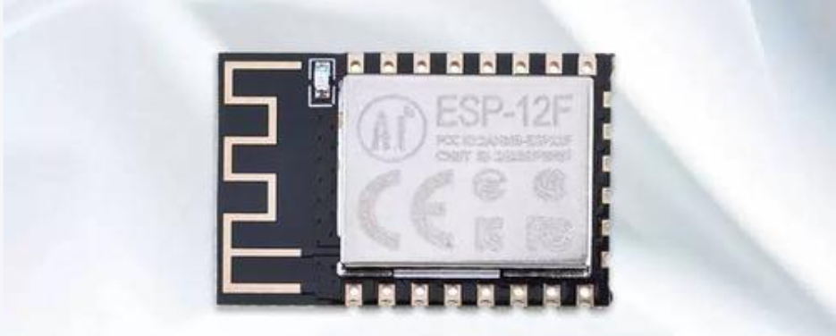

#### 硬件连接

| WIFI 芯片引脚 | STM32F407VET6 引脚 | 说明     |
| ------------ | ------------------ | -------- |
| VCC          | 3.3V               | 电源     |
| GND          | GND                | 公共地   |
| TX           | PD9                | 串口发送 |
| RX           | PD8                | 串口接收 |

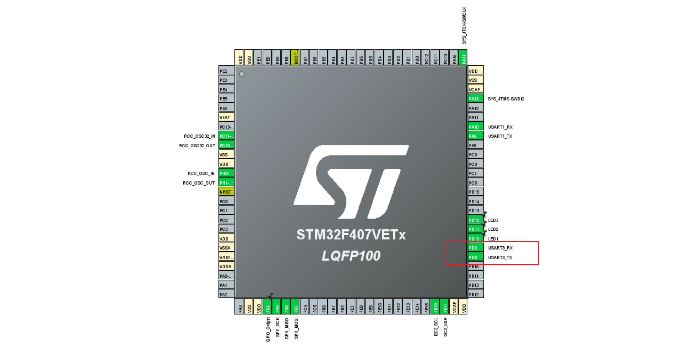

#### CubeMX 配置

**添加路径：**

- 将 `WIFI` 目录添加到工程的头文件路径和源文件路径中。

**USART3 配置：**

- 将 USART3 设置为异步通信模式。
- 根据 WiFi 模块配置波特率、数据位、停止位和校验位。
- USART3 的 TX 连接模块 RX，USART3 的 RX 连接模块 TX。
- 驱动固定使用 CubeMX 生成的 UART 句柄 `huart3`。
- 发送和接收均使用 UART 中断方式，必须开启 USART3 全局中断。

  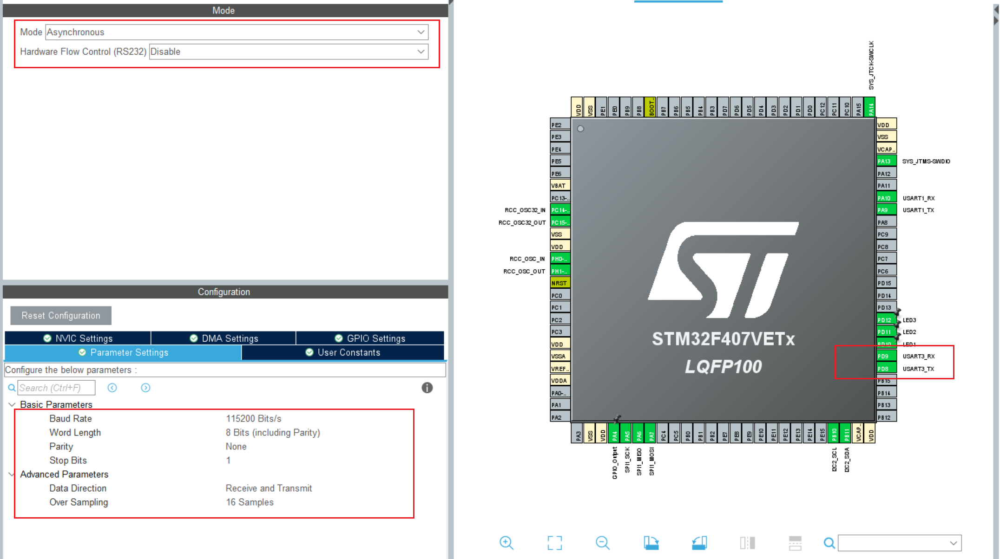

**NVIC 配置：**

- 使能 USART3 全局中断。
- 其他选项保持默认配置。

  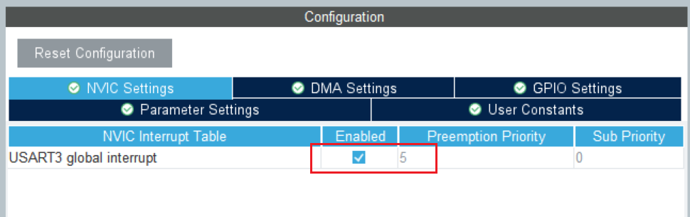

USART3 中断处理函数需要调用 HAL 中断处理接口：

```c
void USART3_IRQHandler(void)
{
    HAL_UART_IRQHandler(&huart3);
}
```

如果工程中已经存在 `HAL_UART_RxCpltCallback()` 或 `HAL_UART_TxCpltCallback()`，需要将本模块的 USART3 处理逻辑合并到已有回调中，避免重复定义。

其他选项保持默认配置。

#### config.h 配置

```c
/* Enable the WIFI12F module. */
#define DEVICE_WIFI    1
#if DEVICE_WIFI
    #include "usart.h"
    #include "dev_wifi.h"
#endif
```

`DEVICE_WIFI` 默认值建议为 `0`，确认 USART3 配置完成并加入本模块源文件后，再改为 `1`。

#### API 接口

```c
int WIFI_Init(void);                                                     /* 初始化 WiFi 模块 */
int WIFI_Connect(const char *name, const char *password);               /* 连接 WiFi */
int WIFI_Disconnect(void);                                               /* 断开 WiFi */
int WIFI_NetConnect(unsigned char type, const char *ip, unsigned int port); /* 连接网络 */
int WIFI_NetDisconnect(unsigned int port);                              /* 断开网络 */
int WIFI_Write(unsigned int port, const unsigned char *data, unsigned int length); /* 发送数据 */
int WIFI_Read(unsigned int port, unsigned char *data, unsigned int length);         /* 接收数据 */
```

网络类型参数可使用以下枚举值：

| 参数 | 含义 |
| --- | --- |
| `UDPServer` | UDP 服务端 |
| `UDPClient` | UDP 客户端 |
| `TCPServer` | TCP 服务端 |
| `TCPClient` | TCP 客户端 |
| `TCPSeed` | TCP 数据流模式 |
| `SSLServer` | SSL 服务端 |
| `SSLClient` | SSL 客户端 |
| `SSLSeed` | SSL 数据流模式 |

调用顺序为：

1. `WIFI_Init()`：创建接收缓冲区、开启 USART3 接收中断并初始化模块。
2. `WIFI_Connect()`：连接无线路由器。
3. `WIFI_NetConnect()`：连接一个 TCP/UDP 网络端点。
4. `WIFI_Write()` 和 `WIFI_Read()`：发送和接收网络数据。
5. `WIFI_NetDisconnect()`：断开当前网络连接。
6. `WIFI_Disconnect()`：断开 WiFi。

返回值为 `ESUCCESS`（0）表示成功，负数表示失败。`WIFI_Write()` 和 `WIFI_Read()` 成功时返回实际处理的字节数。

当前模块只维护一个网络连接，因此同一时间只能有一个有效的 `port`。`WIFI_Read()` 应在服务器发送数据后调用；没有可读数据时会返回负数。

#### 使用示例

```c
#include "dev_wifi.h"
#include "errno.h"

#define WIFI_NAME      "WiFi名称"
#define WIFI_PASSWORD  "WiFi密码"
#define SERVER_IP      "192.168.1.100"
#define SERVER_PORT    8080U

int WIFI_DriverExample(void)
{
    unsigned char txData[] = "hello wifi";
    unsigned char rxData[128] = {0};
    int ret;

    ret = WIFI_Init();
    if(ret != ESUCCESS) return ret;

    ret = WIFI_Connect(WIFI_NAME, WIFI_PASSWORD);
    if(ret != ESUCCESS) return ret;

    ret = WIFI_NetConnect(TCPClient, SERVER_IP, SERVER_PORT);
    if(ret != ESUCCESS)
    {
        WIFI_Disconnect();
        return ret;
    }

    ret = WIFI_Write(SERVER_PORT, txData, sizeof(txData) - 1U);
    if(ret < 0) goto cleanup;

    /* Read after the remote server has sent data. */
    ret = WIFI_Read(SERVER_PORT, rxData, sizeof(rxData));

cleanup:
    WIFI_NetDisconnect(SERVER_PORT);
    WIFI_Disconnect();
    return ret;
}
```

应用层只需要包含 `dev_wifi.h` 和 `errno.h`。`dev_wifi.h` 会通过 `config.h` 引入 `usart.h`，但工程仍必须先完成 USART3 的 HAL 初始化。


---

## 📧 联系方式

- 🐧：2103539430

- 🛰：Ubuntu_Noble
